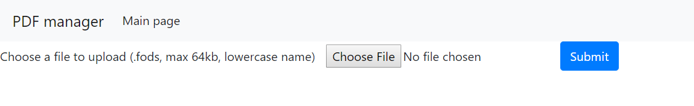
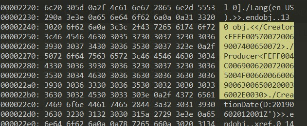
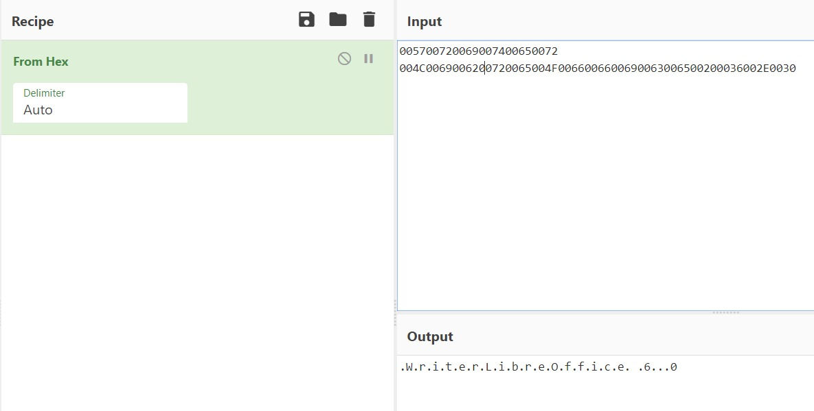
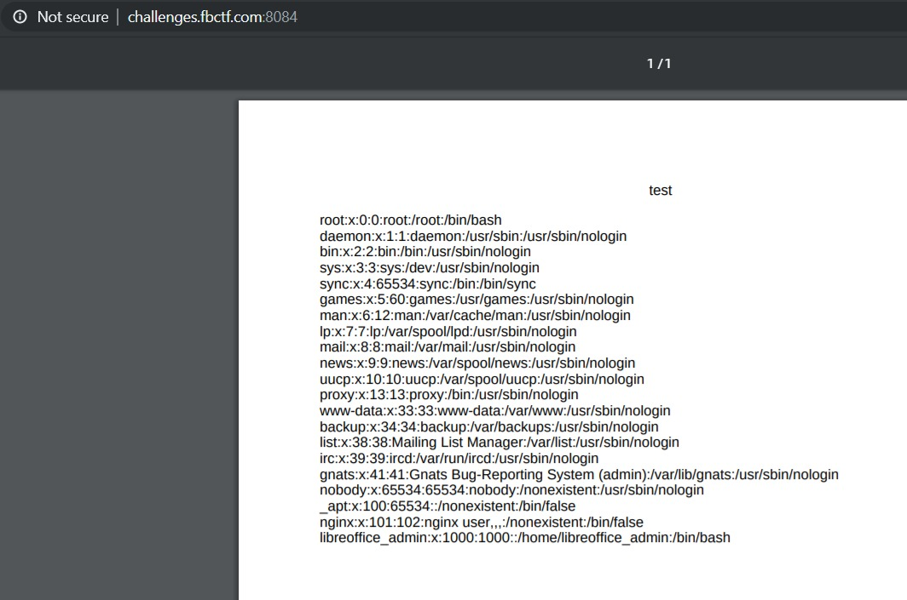
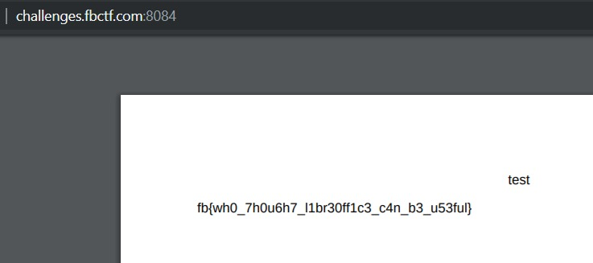

<h1>pdfme</h1>

We setup this PDF conversion service for public use, hopefully it's safe.

http://challenges.fbctf.com:8084

(This problem does not require any brute force or scanning. We will ban your team if we detect brute force or scanning).

--------------------------------

The page is asking for a `.fods` file to be uploaded. After googling around, it appears to be a format used by OpenOffice LibreOffice.

Also by googling around for `pdf converter exploit`, I stumbled across <a href="https://securityonline.info/export-injection-new-server-side-vulnerability/">this article</a> which seemed relevant.

So I created a sample `.fods` document using LibreOffice Calc (installed by default in Ubuntu), uploaded it to the web server, and let it do its magic. I then ran the PDF file returned using `xxd` (a simple hexdump utility) based on the suggestion at the end of the article above.

The output in the `Creator` and `Producer` headers do not look like anything useful, but on further inspection, appears to just be hex-encoded. Using <a href="https://gchq.github.io/CyberChef/">CyberChef</a>, we decode the hex-encoded strings.

Looks like the program that does the conversion on the web server is LibreOffice Writer 6.0. Googling again, there was an <a href="https://www.exploit-db.com/exploits/44022">existing vulnerability</a> with the `=WEBSERVICE` function that allows for remote file disclosure.

Following the proof of concept in the exploit article, we are able to dump out the contents of `/etc/passwd`!

Now, I just tried to guess where the flag would be and the first thing I tried was `/home/libreoffice_admin/flag` based on the list of users in the `/etc/passwd` dump.

