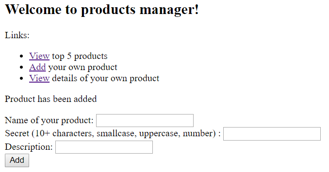
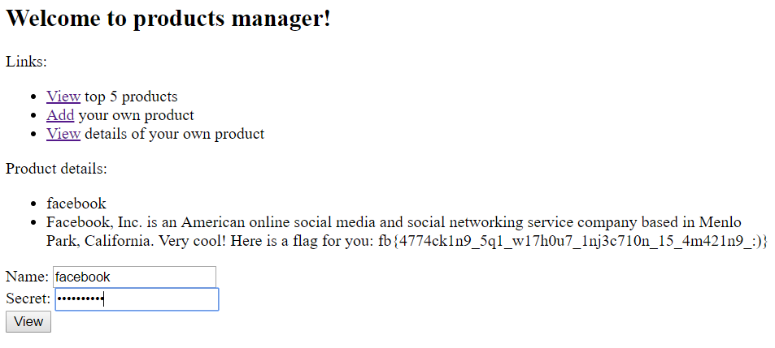

<h1>products manager</h1>

Come play with our products manager application!

http://challenges.fbctf.com:8087

Written by Vampire

(This problem does not require any brute force or scanning. We will ban your team if we detect brute force or scanning).

--------------------------------


Looking at the landing page, it appears to be a site that allows you to add and then view products in some kind of database.

We are also provided with the source code for the site which makes it easier to identify how the site deals with user input.

In particular, we are looking for how SQL queries are passed to the web server.

Looking inside `db.php`:
```
CREATE TABLE products (
  name char(64),
  secret char(64),
  description varchar(250)
);

INSERT INTO products VALUES('facebook', sha256(....), 'FLAG_HERE');
INSERT INTO products VALUES('messenger', sha256(....), ....);
INSERT INTO products VALUES('instagram', sha256(....), ....);
INSERT INTO products VALUES('whatsapp', sha256(....), ....);
INSERT INTO products VALUES('oculus-rift', sha256(....), ....);
```

So it seems that the flag is hiding inside the `description` field of the row with `facebook` in the `name` column.

Let's look for ways to perform SQLi then.

`db.php`:
```
function get_product($name) {
  global $db;
  $statement = $db->prepare(
    "SELECT name, description FROM products WHERE name = ?"
  );
  check_errors($statement);
  $statement->bind_param("s", $name);
  check_errors($statement->execute());
  $res = $statement->get_result();
  check_errors($res);
  $product = $res->fetch_assoc();
  $statement->close();
  return $product;
}
```

Since the PHP functions all use prepared SQL statements, SQLi is well protected against becuase the statement and the data are treated separately.

`view.php`:
```
function handle_post() {
  global $_POST;

  $name = $_POST["name"];
  $secret = $_POST["secret"];

  if (isset($name) && $name !== ""
        && isset($secret) && $secret !== "") {
    if (check_name_secret($name, hash('sha256', $secret)) === false) {
      return "Incorrect name or secret, please try again";
    }

    $product = get_product($name);

    echo "<p>Product details:";
    echo "<ul><li>" . htmlentities($product['name']) . "</li>";
    echo "<li>" . htmlentities($product['description']) . "</li></ul></p>";
  }

  return null;
}
```

It also appears that the server will only allow us to lookup products if we know the corresponding secret.

So maybe we can trick the server by adding another `facebook` product so that it will spit out the row with the flag since `get_product` only searches using `name`, and we can use the `secret` that we used to add our new `facebook` product.

`add.php`:
```
	$product = get_product($name);
	if ($product !== null) {
	  return "Product name already exists, please enter again";
	}
```

It appears that new products cannot use a `name` that already exists. However, it is possible to trick the server by adding trailing whitespaces. E.g. `facebook ` instead of `facebook`. This works because the `char` datatype already pads the data with trailing whitespaces, so adding one or more whitespaces makes no real difference when we perform the `INSERT` statement into the database. However, when we do `get_product` with `facebook `, it will not match with `facebook`.

You can read more about it <a href="https://dev.mysql.com/doc/refman/5.7/en/char.html">here</a>.





