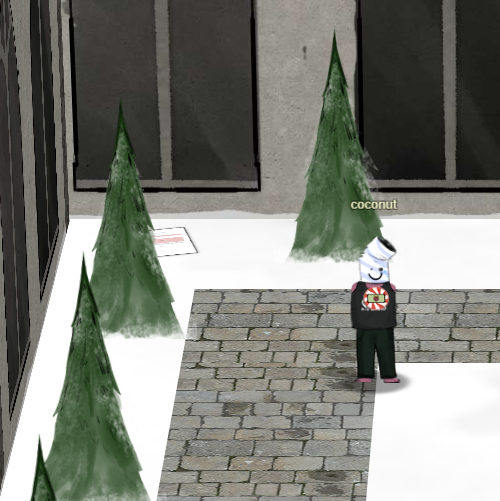
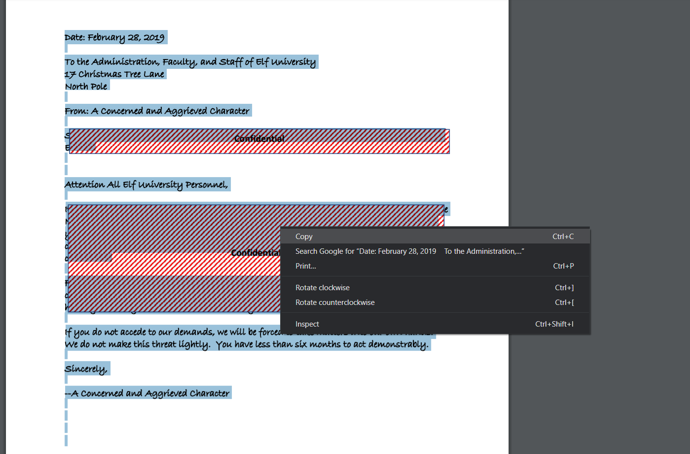
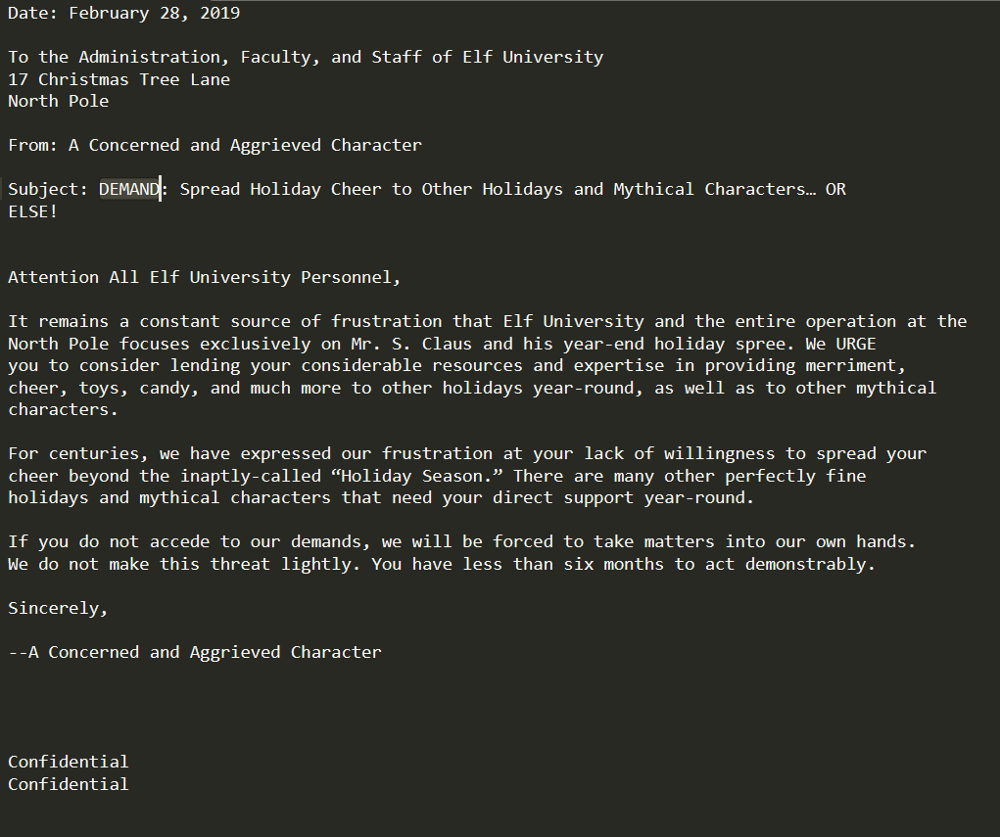

# Unredact Document

## Where To Find The Document

The document we are looking for can be found at the top left corner of the Quad.

## Getting The Flag

If we open up the document, we see that it has been redacted with some boxes.

The easiest way to get the content is simply to select the text underneath and paste in in your favorite text editor.

