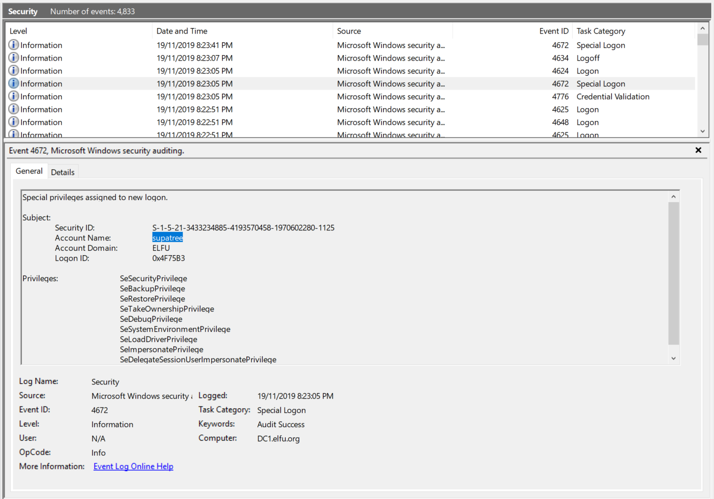

# Windows Security Evtx

## Getting The Flag

We open the <a href='src/Security.evtx'>Windows Event Log File</a> and start perusing through them. The logs are already sorted by the most recent events first. The last successful logon we see belongs to `supatree` right after a bunch of failed logon attempts.

*Answer: supatree*
