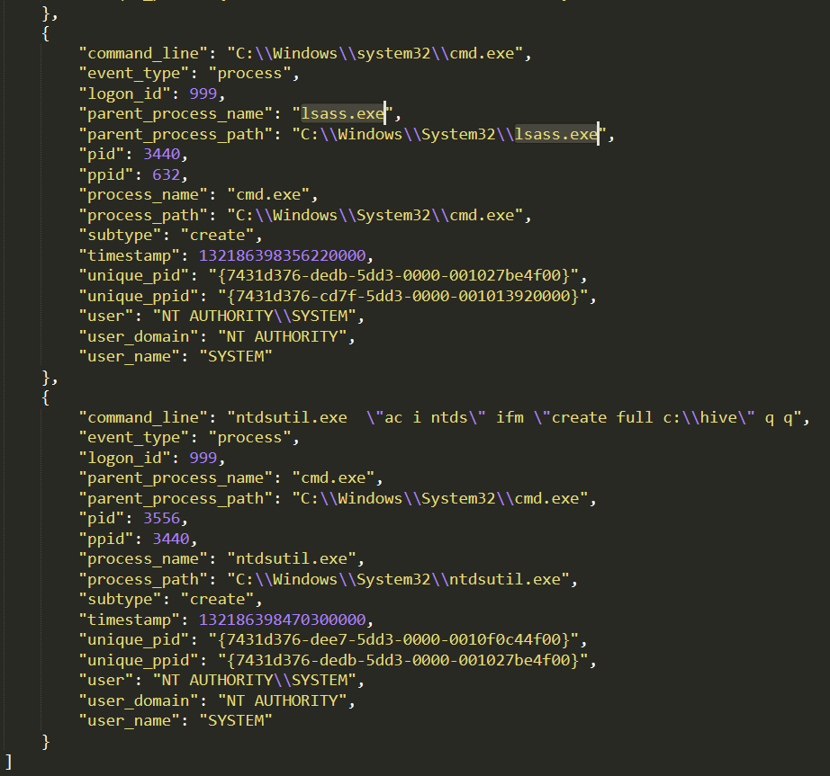

# Windows Sysmon

## Getting The Flag

If we search through the <a href='src/sysmon-data.json'>log file</a> for `lsass.exe`, we see that it appears once as the parent process of a `cmd.exe` process.

Looking at the `pid` of `lssas.exe`, we see that the `pid` is `3440`. There is only one process that has `3440` as its `ppid`, and that is `ntdsutil.exe`. `ntdsutil.exe` is a <a href='https://pentestlab.blog/2018/07/04/dumping-domain-password-hashes/'>command line tool</a> that is part of the domain controller ecosystem and its purpose is to enable administrators to access and manage the windows Active Directory database. However, it can be abused to take a snapshot of the existing `ntds.dit` file which can be copied into a new location for offline analysis and extraction of password hashes.

*Answer: ntdsutil*