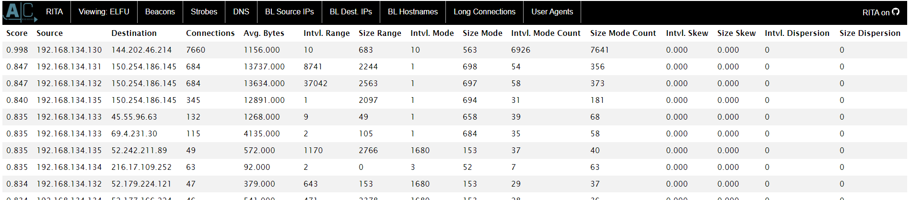

# Zeek Logs Analysis

## Viewing Zeek Logs On RITA

The <a href='src/elfu-zeeklogs.zip'>zip file</a> provided conveniently comes with RITA already exported in it. This way, we simply need to browse to the correct view to look at the overall statistics of the content in the log files rather than comb through them one by one.

Simply navigate to `elfu-zeeklogs/ELFU/index.html` to get to the main page.

Click `ELFU` to view the available sub-views available to us. Since we are looking for a malware-infected system, we can assume that such a system may be beaconing. That is to say that they call out to a Command-and-Control (C2) server periodically for commands. Click the `Beacons` tab to access this view on RITA.

In RITA, the tables are sorted by score in descending order. In short, the higher the score (closer to 1.0), the more concerning the traffic is. In the `Beacons` tab, the top IP address is 192.168.134.130, and it has a score of 0.998. Looking across the rest of its columns, we see that the IP address has made 6926 counts of traffic to 144.202.46.214 with an interval of 10 seconds between connections. This is definitely suspicious, and this IP address is therefore our answer.

*Answer: 192.168.134.130*