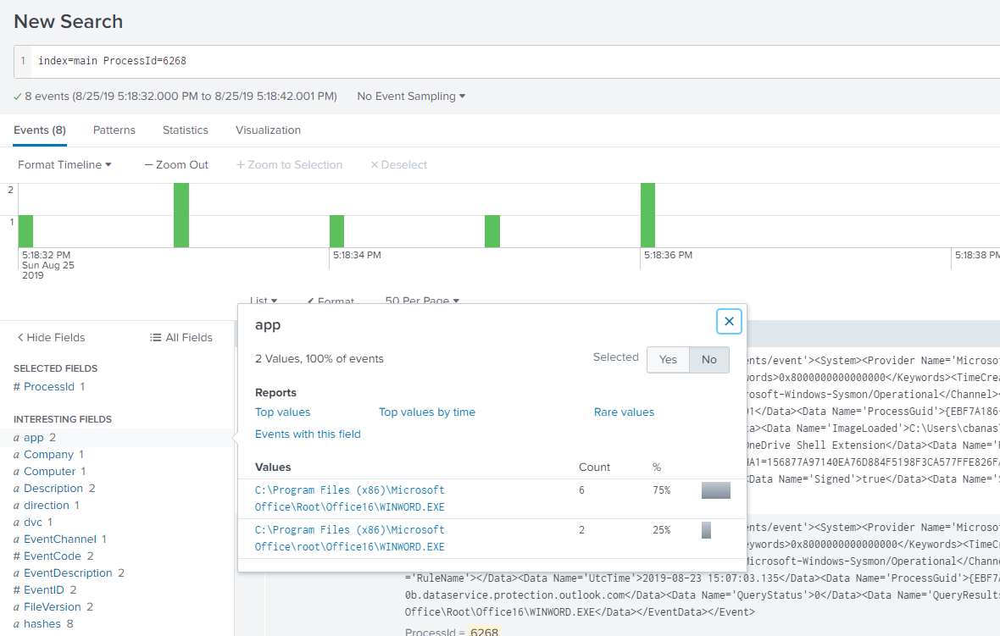

# Splunk

https://splunk.elfu.org/

Username: elf

Password: elfsocks

## Training Questions

### 1. What is the short host name of Professor Banas' computer?

Our first answer is in the #ELFU SOC chat.

*Answer: sweetums*

### 2. What is the name of the sensitive file that was likely accessed and copied by the attacker? Please provide the fully qualified location of the file. (Example: C:\temp\report.pdf)

If we assume that sensitive files are user files, and all user files are within their home directory, then we should search for log entries that mention `C:\Users\cbanas`.

*Answer: C:\Users\cbanas\Documents\Naughty_and_Nice_2019_draft.txt*

### 3. What is the fully-qualified domain name(FQDN) of the command and control(C2) server? (Example: badguy.baddies.com)

We start with the search provided by the <a href='https://splunk.elfu.org/en-US/app/SA-elfusoc/search?q=search%20index%3Dmain%20sourcetype%3DXmlWinEventLog%3AMicrosoft-Windows-Sysmon%2FOperational%20powershell%20EventCode%3D3&display.page.search.mode=smart&dispatch.sample_ratio=1&earliest=0&latest=now&display.general.type=events&display.page.search.tab=events&sid=1578029745.6309'>hint</a>. Looking at the `Interesting Fields` column, we see that the only occurrence of a `DestinationHostname` is `144.202.46.214.vultr.com`.

*Answer: 144.202.46.214.vultr.com*

### 4. What document is involved with launching the malicious PowerShell code? Please provide just the filename. (Example: results.txt)

Starting from the <a href='https://splunk.elfu.org/en-US/app/SA-elfusoc/search?q=search%20index%3Dmain&display.page.search.mode=smart&dispatch.sample_ratio=1&earliest=1566753512&latest=1566753522.001&display.general.type=events&display.page.search.tab=events&sid=1578030103.6341'>first hint</a>, we should end up with 2 `ProcessId` (not to be confused with process_id). Between the 2, `6268` seems to be the PID that we should be interested in as it shows that `WINWORD.EXE` was executed within the 10 second window of the first entry in the powershell logs. We just need to look for the file that launched this process.

In order to find the file that launched this process, we use the <a href='https://splunk.elfu.org/en-US/app/SA-elfusoc/search?q=search%20index%3Dmain%20sourcetype%3DWinEventLog%20EventCode%3D4688%200x187c&display.page.search.mode=smart&dispatch.sample_ratio=1&earliest=0&latest=&display.general.type=events&display.page.search.tab=events&display.events.fields=%5B&sid=1578030850.6429'>second hint</a> and add an extra search term for the hexadecimal representation of `6268` (which is `0x187c`). Looking at the `Process Command Line` we can see that `WINWORD.EXE` opens the file *19th Century Holiday Cheer Assignment.docm*

*Answer: 19th Century Holiday Cheer Assignment.docm*

### 5. How many unique email addresses were used to send Holiday Cheer essays to Professor Banas? Please provide the numeric value. (Example: 1)

From the initial search query given to us, we can see that there are 42 entries in the table shown. If we assume that all the emails shown contain a submission followed by a response by Professor Banas, we can divide 42 by 2 and arrive at 21 unique email addresses. Another way is by using a <a href='https://splunk.elfu.org/en-US/app/SA-elfusoc/search?q=search%20index%3Dmain%20sourcetype%3Dstoq%20results%7B%7D.workers.smtp.from%3D%22Carl%20Banas%20%3CCarl.Banas%40faculty.elfu.org%3E%22%20%7C%20table%20_time%20results%7B%7D.workers.smtp.to%20results%7B%7D.workers.smtp.from%20%20results%7B%7D.workers.smtp.subject%20results%7B%7D.workers.smtp.body&display.page.search.mode=smart&dispatch.sample_ratio=1&earliest=0&latest=&display.general.type=statistics&display.page.search.tab=statistics&display.events.fields=%5B&sid=1578032034.6498'>modified search query</a> that simply shows only the emails that Professor Banas has replied to, which is 21.

*Answer: 21*

### 6. What was the password for the zip archive that contained the suspicious file?

If we return to the <a href='https://splunk.elfu.org/en-US/app/SA-elfusoc/search?q=search%20index%3Dmain%20sourcetype%3Dstoq%20results%7B%7D.workers.smtp.from%3D%22Carl%20Banas%20%3CCarl.Banas%40faculty.elfu.org%3E%22%20zip%20%7C%20table%20_time%20results%7B%7D.workers.smtp.to%20results%7B%7D.workers.smtp.from%20%20results%7B%7D.workers.smtp.subject%20results%7B%7D.workers.smtp.body&display.page.search.mode=smart&dispatch.sample_ratio=1&earliest=0&latest=&display.general.type=statistics&display.page.search.tab=statistics&display.events.fields=%5B&sid=1578032560.6536'>search query</a> in the previous question and add a search term for `zip`, we will end up with just one email. Inside the email body, we can see the password of the zip file.

*Answer: 123456789*

### 7. What email address did the suspicious file come from?

In the same search results screen as the previous question, we can also see the email address that the zip file was sent from.

*Answer: Bradly.Buttercups@eIfu.org*

## Challenge Question

### What was the message for Kent that the adversary embedded in this attack?

If we follow the hint and use the given <a href='https://splunk.elfu.org/en-US/app/SA-elfusoc/search?q=search%20index%3Dmain%20sourcetype%3Dstoq%20%20%22results%7B%7D.workers.smtp.from%22%3D%22bradly%20buttercups%20%3Cbradly.buttercups%40eifu.org%3E%22%20%7C%20eval%20results%20%3D%20spath(_raw%2C%20%22results%7B%7D%22)%20%0A%7C%20mvexpand%20results%0A%7C%20eval%20path%3Dspath(results%2C%20%22archivers.filedir.path%22)%2C%20filename%3Dspath(results%2C%20%22payload_meta.extra_data.filename%22)%2C%20fullpath%3Dpath.%22%2F%22.filename%20%0A%7C%20search%20fullpath!%3D%22%22%20%0A%7C%20table%20filename%2Cfullpath&display.page.search.mode=smart&dispatch.sample_ratio=1&earliest=0&latest=&display.general.type=statistics&display.page.search.tab=statistics&display.events.fields=%5B&sid=1578032960.6541'>search query</a>, we get a convenient view of the associated filepaths within the provided <a href='http://elfu-soc.s3-website-us-east-1.amazonaws.com/'>File Archive</a> for each filename.

The file we are interested in is `core.xml`, which contains the properties of a Microsoft Word Document. The file has been archived as `ff1ea6f13be3faabd0da728f514deb7fe3577cc4`, and can be found <a href='src/ff1ea6f13be3faabd0da728f514deb7fe3577cc4'>here</a>. If we open the file up in notepad of any text editor, we see our flag.

*Answer: Kent you are so unfair. And we were going to make you the king of the Winter Carnival.*