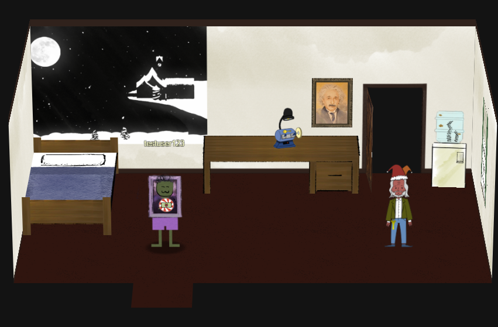
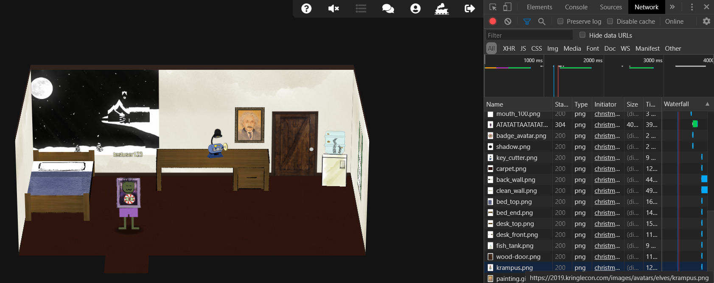
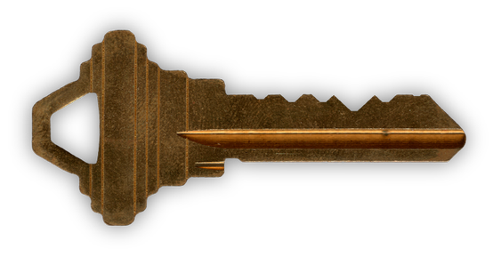

# Steam Tunnels

## Finding The Key

When we enter the dorm room, we see a suspicious character scurry off into the closet.

He looks like he has a key! How can we retrieve the highest resolution of the image? The original image can be retrieved from the `Network` tab in the Developer's View.

We find that the character image is named <a href='src/krampus.png'>`krampus.png`</a>.

## Finding The Right Key Bitting Template

The hint provided to us directs us to a very helpful talk on <a href='https://www.youtube.com/watch?v=KU6FJnbkeLA'>Optical Decoding of Keys</a>. The talk also provides a link to a github page with <a href='https://github.com/deviantollam/decoding'>Key Bitting Templates</a> that allow us to figure out the bitting of the key image we got from Krampus. Based on the key image, it appears to be <a href='src/Decoding - Schlage.png'>Schlage</a>. So we use the appropriate template and after a bit of trial and error, we find that the key bitting of <a href='src/122520.png'>`122520`</a> fits the lock in the closet.

