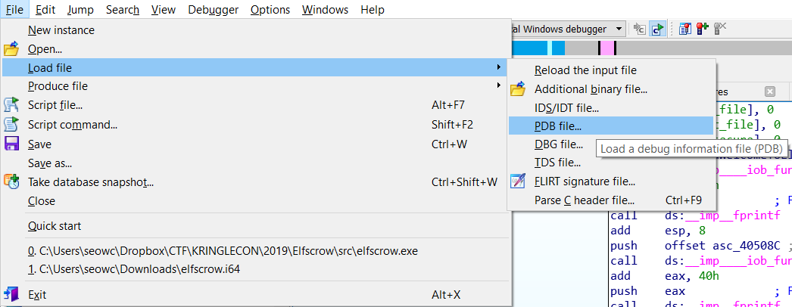
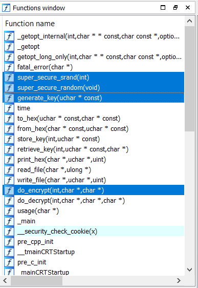
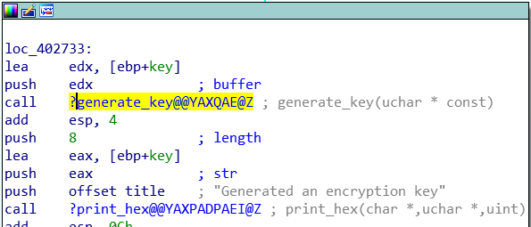
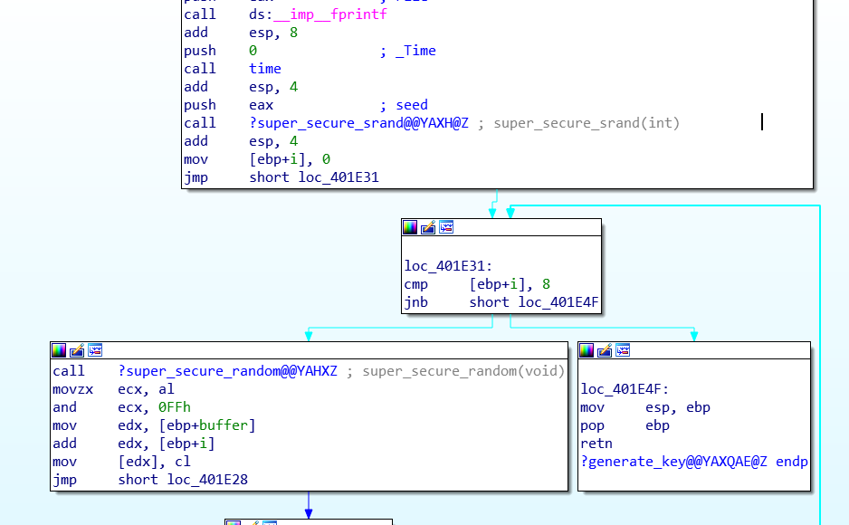
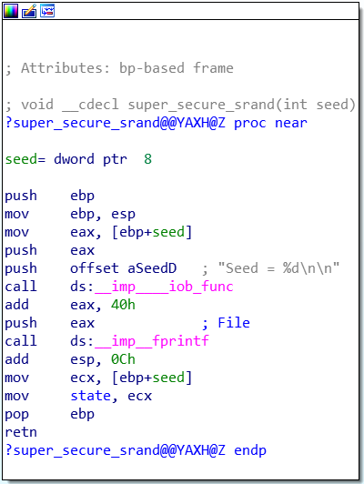
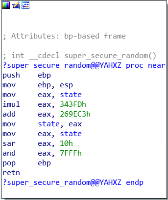
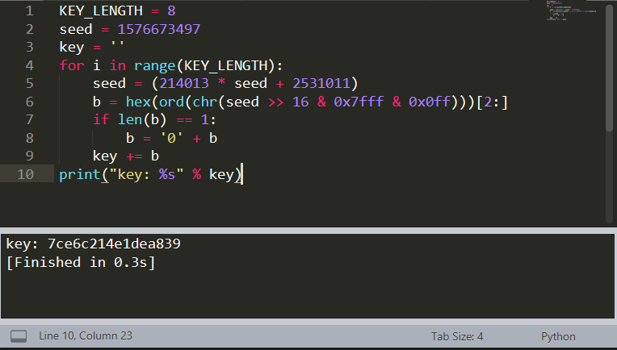

# Elfscrow Encryption Challenge

## Initial Encryption Executable Exploration

If we run `elfscrow.exe`, we see that we can use it to either encrpyt of decrypt files. If we test the encrpyt functionality of the program, we see that it tells us what the seed is, followed by what the generated encryption key is.

```
Welcome to ElfScrow V1.01, the only encryption trusted by Santa!


* WARNING: You're reading from stdin. That only partially works, use at your own risk!

Our miniature elves are putting together random bits for your secret key!

Seed = 1576673136

Generated an encryption key: e2f87c0cb8919d23 (length: 8)
```

Looking at the seed, we immediately recognize that the seed is the system epoch time in seconds. Furthermore, the encryption key tells us that the key is 8 hex bytes long. This most likely means it is using DES encrytion.

We can also run the encryption process in rapid succession if we disconnect from the internet. This shows us that given a particular seed, the encryption key generated is completely deterministic. In other words, if we know the key generation algorithm and time of encryption, we could easily decrypt any file that was encrypted by the program.

```
λ elfscrow.exe --encrypt test1.txt
Welcome to ElfScrow V1.01, the only encryption trusted by Santa!

Our miniature elves are putting together random bits for your secret key!

Seed = 1576673497

Generated an encryption key: 7ce6c214e1dea839 (length: 8)

Elfscrowing your key...

Elfscrowing the key to: elfscrow.elfu.org/api/store

Uh oh, something went very wrong. That's not supposed to happen.
Please don't tell Santa :(

HttpSendRequest failed: The server name or address could not be resolved
 (12007)

λ elfscrow.exe --encrypt test1.txt
Welcome to ElfScrow V1.01, the only encryption trusted by Santa!

Our miniature elves are putting together random bits for your secret key!

Seed = 1576673497

Generated an encryption key: 7ce6c214e1dea839 (length: 8)

Elfscrowing your key...

Elfscrowing the key to: elfscrow.elfu.org/api/store

Uh oh, something went very wrong. That's not supposed to happen.
Please don't tell Santa :(

HttpSendRequest failed: The server name or address could not be resolved
 (12007)
```

## Figuring Out The Encryption Mode

We already have a good guess that the encryption algorithm is probably DES. The other thing we need to find out is the encryption mode. If we test the program by encrypting text files that contain various lengths of the letter 'A', we notice that the ciphertext generated has a length in multiples of 8, indicating that it is a block cipher mode. Thankfully, we don't have to guess too much because by performing `strings elfscrow.exe`, we see the error string `CryptImportKey failed for DES-CBC key`, telling us both the encryption algorithm and the mode.

## Disassembling The Encryption Executable

We open `elfscrow.exe` in IDA and load the given `elfscrow.pdb` file.



### Random Key Generation Algorithm

Looking at the functions window, we can now see the custom functions defined within the executable. We are interested in finding out how the key is generated.



Looking inside `do_encrypt`, we see that it calls `generate_key`.



Looking inside `generate_key`, we see that the function first calls `time`, then `super_secure_srand`, then calls `super_secure_random` 8 times.



### Weak Pseudo Random Number Generation Algorithm

Looking inside `super_secure_srand`, we realize that it does nothing but copies the seed into the variable `state`.



Finally, looking inside `super_secure_random` is where the real key generation occurs. 
1. `state` is copied into `eax`.
2. `eax` is multiplied by `343fDh` (which is hexadecimal for 214013).
3. `eax` then has `269EC3h` (which is hexadecimal for 2531011) added to it.
4. The value in `eax` is then saved in `state`. 
5. `eax` is then shifted bitwise to the right `10h` (which is hexadecimal for 16) times.
6. `eax` then goes through an AND filter with `7FFFh`.

Outside `super_secure_random`, we see there is another AND filter with `0FFh` applied, making our calculated variable one byte long. The whole process then repeats 8 times.



## Reverse Engineering The Key Generation Algorithm

Now that we know the exact arithmetic to calculate key byte by byte, we can use the following python code snippet to calculate the key from a given seed.

### From Assembly Code To Arithmetic

```
KEY_LENGTH = 8
seed = 1576673497
key = ''
for i in range(KEY_LENGTH):
    seed = (214013 * seed + 2531011)
    b = hex(ord(chr(seed >> 16 & 0x7fff & 0x0ff)))[2:]
    if len(b) == 1:
        b = '0' + b
    key += b
print("key: %s" % key)
```

### Testing The Reverse Engineered Algorithm

Comparing it to the key generated by the executable, we see that they are an exact match!



## Putting It All Together

Great! Now all we need to do is to find the right seed that will generate the right decrpytion key for the encrypted PDF document. Since we will be testing out a whole bunch of seeds, the process will need to be automated using a <a href='src/crypto.py'>script</a>.

```
from Crypto.Cipher import DES
import PyPDF2
import os


KEY_LENGTH = 8
START = 1575658800
END = 1575666000
IV = 8 * b'\x00'

with open('ElfUResearchLabsSuperSledOMaticQuickStartGuideV1.2.pdf.enc', 'rb') as f:
    ciphertext = f.read()

for seed in range(START, END):
    key = ''
    for i in range(KEY_LENGTH):
        seed = (214013 * seed + 2531011)
        b = hex(ord(chr(seed >> 16 & 0x7fff & 0x0ff)))[2:]
        if len(b) == 1:
            b = '0' + b
        key += b
    cipher = DES.new(bytes.fromhex(key), DES.MODE_CBC, IV=IV)
    with open('output/%s.pdf' % key, 'wb') as f:
        f.write(cipher.decrypt(ciphertext))
    try:
        with open('output/%s.pdf' % key, "rb") as f:
            PyPDF2.PdfFileReader(f)
        print("DECRYPTION SUCCESSFUL! -> %s.pdf" % key)
        break
    except PyPDF2.utils.PdfReadError:
        os.remove('output/%s.pdf' % key)

```

The code above will eventually find the key to be `b5ad6a321240fbec`, and the decrypted file will be saved in the `output` folder.