# Sleigh Workshop Door

https://sleighworkshopdoor.elfu.org/

## Lock 01

### Riddle

```
I locked the crate with the villain's name inside. Can you get it out?
You don't need a clever riddle to open the console and scroll a little.
```

_Hint 1: Google: "[your browser name] developer tools console"_

_Hint 2: The code is 8 char alphanumeric_

### Solution

All browsers will have something called a console, where you can interact with the Document Object Model (DOM) or execute javascript commands locally.

The first flag is located in the console view. On chrome, press `Ctrl + Shift + I` to bring up the developer window, then navigate to the `Console` view to see the flag.

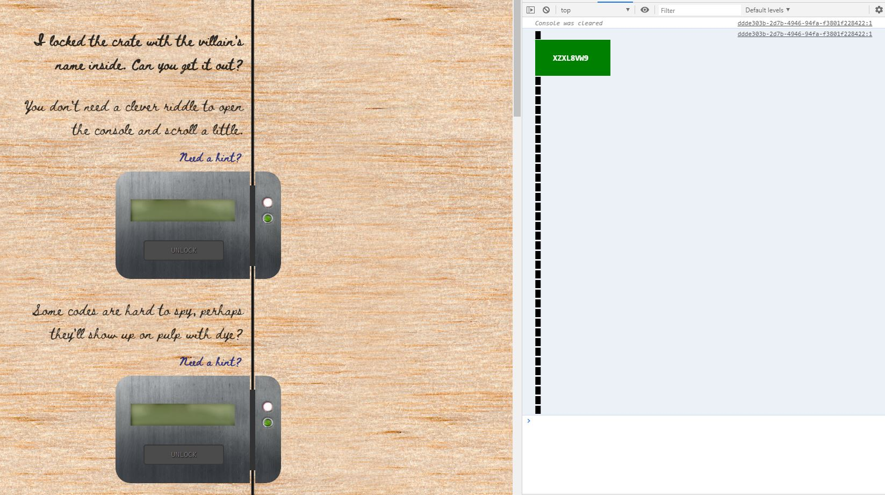

## Lock 02

### Riddle

```
Some codes are hard to spy, perhaps they'll show up on pulp with dye?
```

_Hint 1: Most paper is made out of pulp._

_Hint 2: How can you view this page on paper?_

_Hint 3: Emulate `print` media, print this page, or view a print preview._

### Solution

Press `Ctrl + P` on chrome to view the print preview of the page. The flag will appear next to the lock.

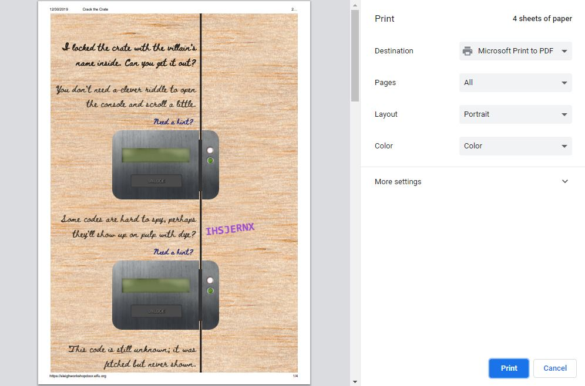

## Lock 03

### Riddle

```
This code is still unknown; it was fetched but never shown.
```

_Hint 1: Google: "[your browser name] view network"_

_Hint 2: Examine the network requests._

### Solution

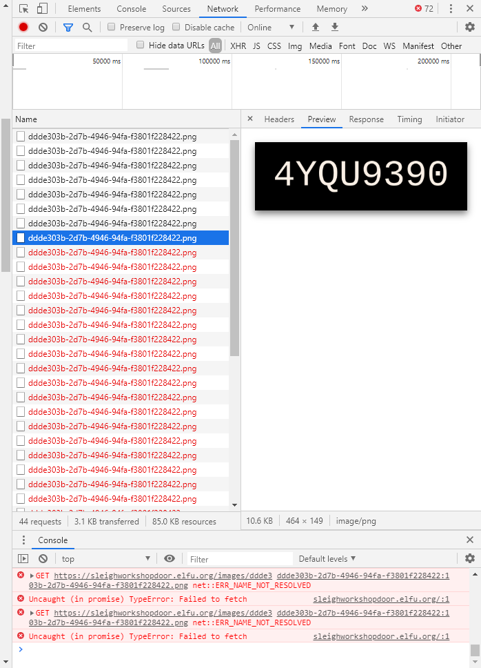

## Lock 04

### Riddle

```
Where might we keep the things we forage? Yes, of course: Local barrels!
```

_Hint 1: Google: "[your browser name] view local storage"_

### Solution

You can find the local storage view under the `Application` tab in the developer window.

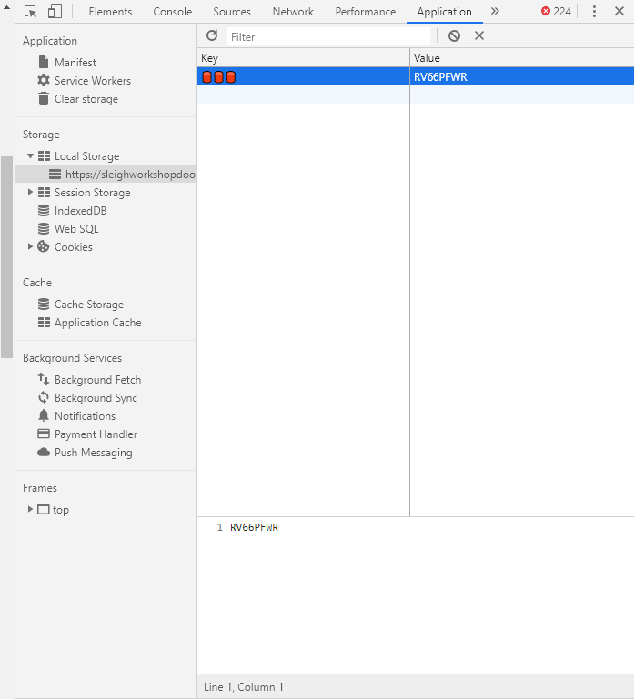

## Lock 05

### Riddle

```
Did you notice the code in the title? It may very well prove vital.
```

_Hint 1: There are several ways to see the full page title:_

_- Hovering over this browser tab with your mouse_

_- Finding and opening the &lt;title&gt; element in the DOM tree_

_- Typing `document.title` into the console_

### Solution

The easiest way to find this flag is to type `document.title` into the console.

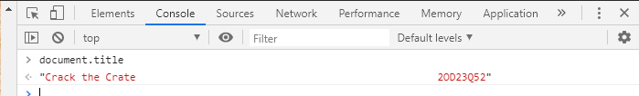

## Lock 06

### Riddle

```
In order for this hologram to be effective, it may be necessary to increase your perspective.
```

_Hint 1: `perspective` is a css property._

_Hint 2: Find the element with this css property and increase the current value._

### Solution

You can inspect a particular element in the DOM by right-clicking it and selecting `Inspect element`.

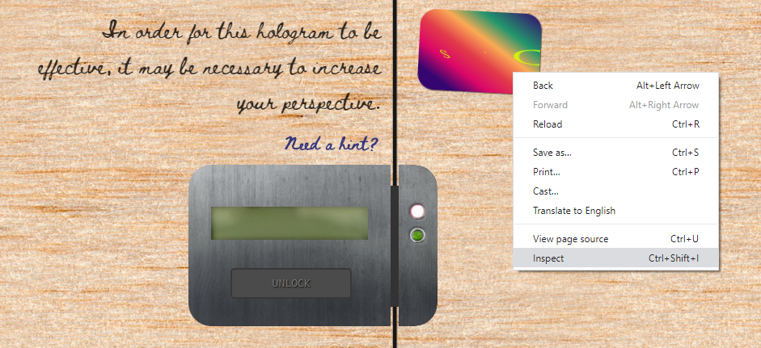

This will automatically select the object in the DOM view. Under the `styles` tab, you will be able to view and modify all the CSS that applies to this object. We are interested in the `perspective` CSS property. We can make the flag readable by unchecking the box for `perspective`.

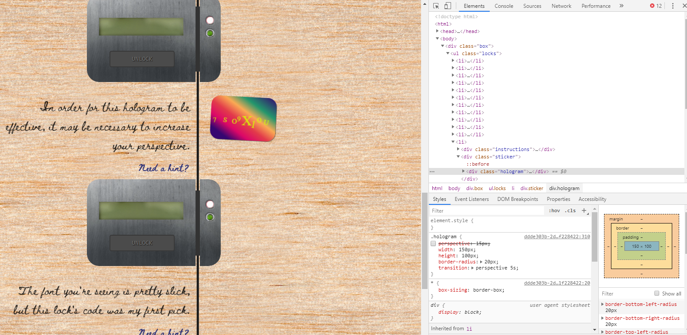

## Lock 07

### Riddle

```
The font you're seeing is pretty slick, but this lock's code was my first pick.
```

_Hint 1: In the `font-family` css property, you can list multiple fonts, and the first available font on the system will be used._

### Solution

Looking at the DOM view, we need to expand the `<head>...</head>` tag to look at what font was used.

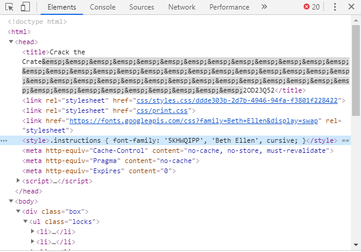

## Lock 08

### Riddle

```
In the event that the .eggs go bad, you must figure out who will be sad.
```

_Hint 1: Google: "[your browser name] view event handlers"_

### Solution

Inside the DOM view for this lock, we see that the `.eggs` span class is `eggs`. Under `Event Listeners`, we can expand `spoil`, and look at the `handler` to see that `VERONICA` will be sad when the .eggs go bad.

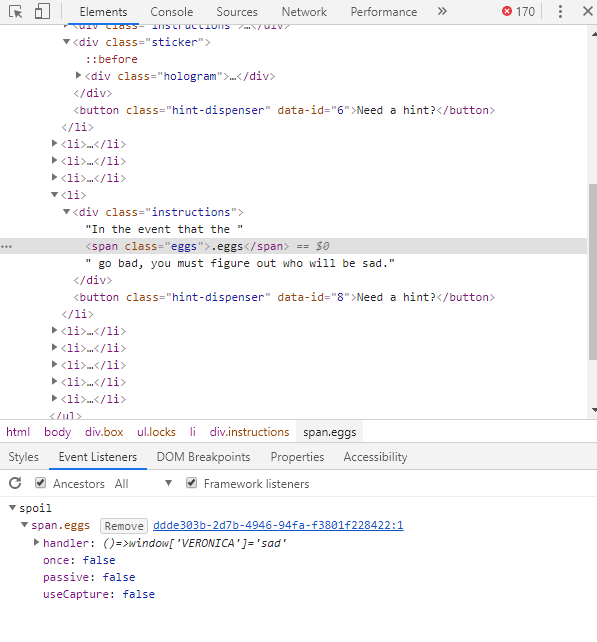

## Lock 09

### Riddle

```
This next code will be unredacted, but only when all the chakras are :active.
```

_Hint 1: `:active` is a css pseudo class that is applied on elements in an active state._

_Hint 2: Google: "[your browser name] force psudo classes"_

### Solution

Looking at the DOM for this lock, we see that there are some words in the riddle that are part of the `span.chakra` class. If we click on these words in the browser, we see them change state, causing parts of the flag to appear.

We can permenantly set these `span.chakra` elements to `:active` by selecting the elements in the DOM view and finding the `Force element state` view (for chrome, I had to click on the `:hov` tag under the `Styles` tab).

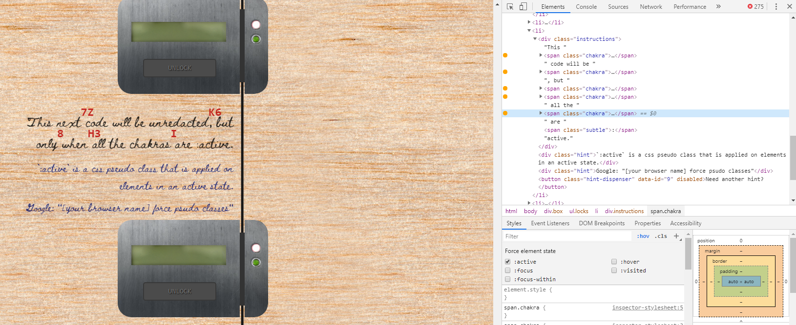

## Lock 10

### Riddle

```
Oh, no! This lock's out of commission! Pop off the cover and locate what's missing.
```

_Hint 1: Use the DOM tree viewer to examine this lock. you can search for items in the DOM using this view._

_Hint 2: You can click and drag elements to reposition them in the DOM tree._

_Hint 3: If an action doesn't produce the desired effect, check the console for error output._

_Hint 4: Be sure to examine that printed circuit board._

### Solution

This is the most interesting lock. The first thing to notice when we explore the DOM view of this lock is that compared to the previous locks, this lock has a `<div class="cover">...</div>` object.

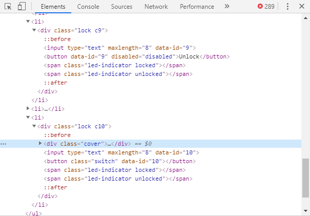

In the DOM view, we can simply get rid of an element by deleting it. Just press `Delete` on your keyboard.

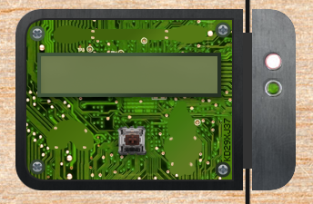

On the bottom right corner of the exposed circuit board, we see the flag. However, typing it into the lock won't work just like that. It seems we need to "fix" the lock.

The hints mention to check the console for error output. So let's do just that.

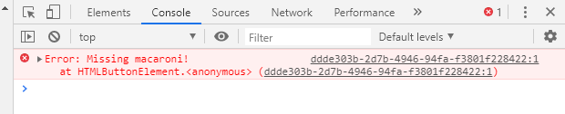

The console says that we are missing a ... macaroni?

That's odd. Let's try searching in the DOM for a macaroni. We can search in the DOM view by pressing `Ctrl + F`.

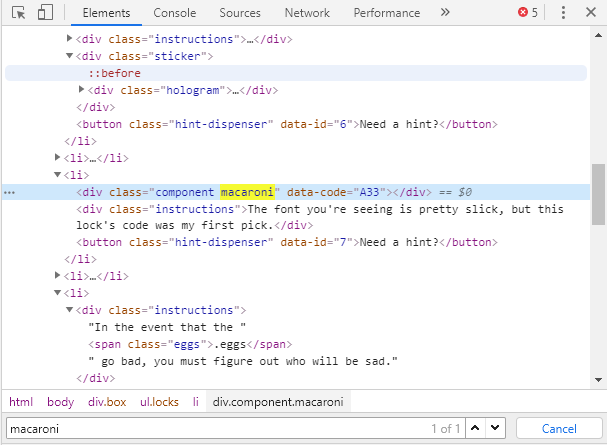

We found the macaroni! Another hint says that we can click and drag elements to reposition them in the DOM tree, so let's try to move the macaroni to the lock.

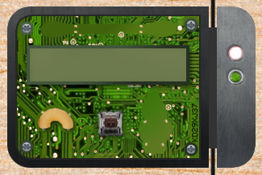

If we try to press the lock switch again, we get a different error message on the console. By repeating this process of hunting down these `components` and dragging them to the lock, we will eventually unlock the final lock.

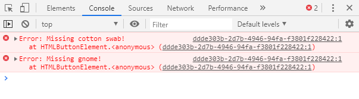

This is what the final lock will look like.

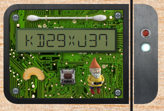
